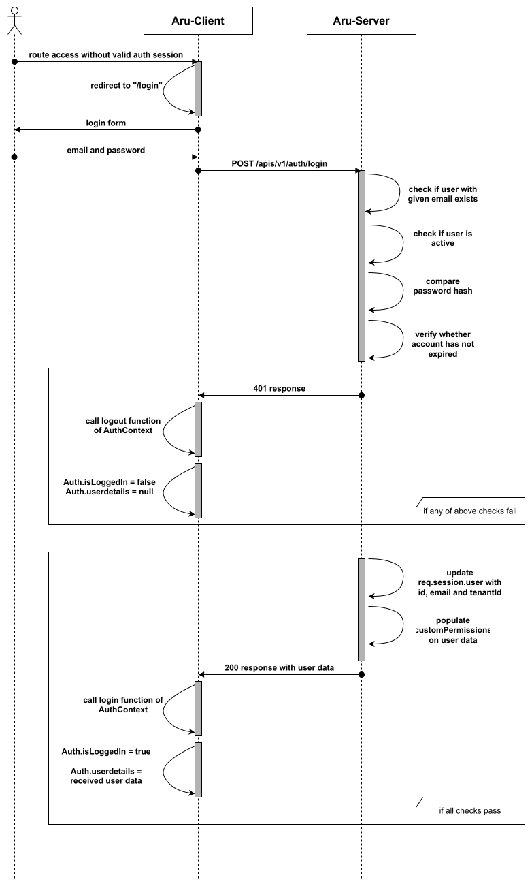
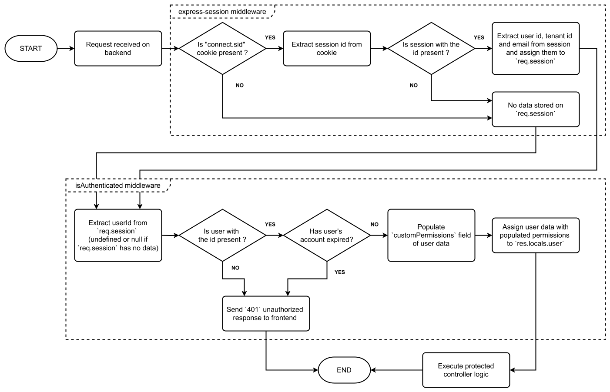
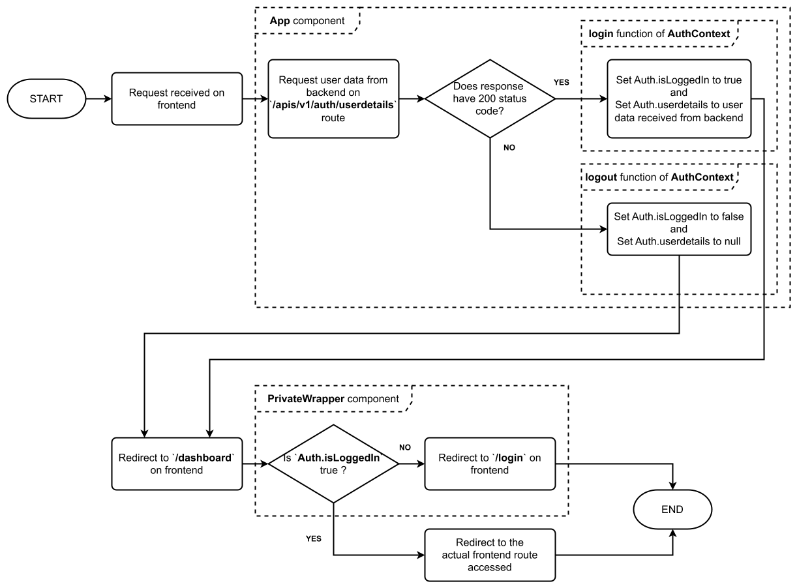
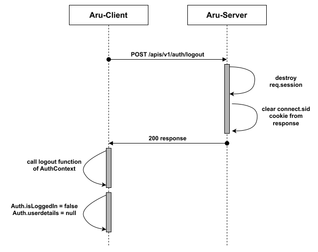
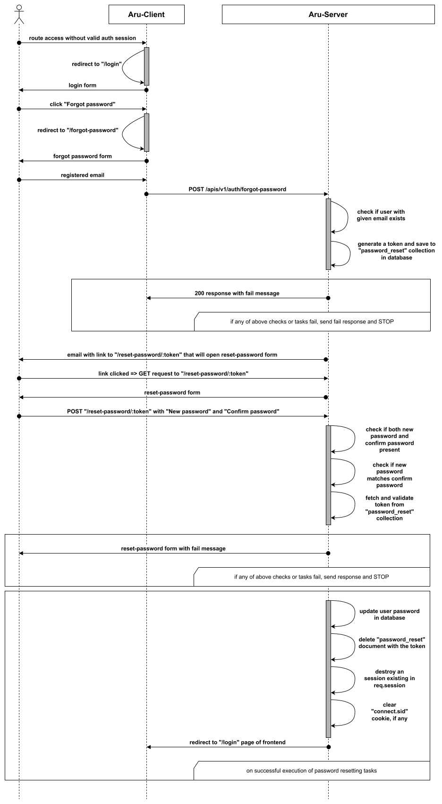

# Authentication on Aru

On the Aru platform, for authentication, a `session-based` approach is used on the backend and a `cookie-based` approach on the frontend.

## Table of Contents

- [Authentication on Aru](#authentication-on-aru)
  - [Table of Contents](#table-of-contents)
  - [Login functionality](#login-functionality)
  - [Session detection](#session-detection)
    - [On the backend](#on-the-backend)
    - [On the frontend](#on-the-frontend)
  - [Logout functionality](#logout-functionality)
  - [Changing password](#changing-password)
  - [Account creation](#account-creation)
  - [Security measures](#security-measures)

## Login functionality

The below diagram describes the flow of events that occur during login:

**Steps involved**
- **On frontend**
  - Any frontend route is accessed with invalid or empty `connect.sid` cookie on browser (un-authorized access)
  - User gets re-directed to `/login` page on fontend
  - User fills `email` and `password` and submits the login form
  - `POST` request with `email` and `password` in body gets sent to `/apis/v1/auth/login` route 
- **On backend**
  - The controller associated with `/login` route verifies the following
    - Verifies whether a user with the given `email` exists in the database
    - Verifies whether the hash of given `password` matches with that stored in the database
    - Verifies whether the user is NOT `inactive`
    - Verifies whether the user is NOT of type `standalone-user`
    - Verifies whether the `expiryDate` of the user account has not yet passed
  - If any of the above verifications fail, a `401` response with login failed message is sent to back
  - If all verifications pass, then:
    - `req.session.user` is initialized with `id`, `tenantId` and `email` of logged in user, for creation of `express-session` based `session`
    - The `customPermissions` field in the user's data is populated and a `200` response is sent back with the user data
- **Back on frontend**
  - on successfull login:
    - `login` function of `AuthContext` gets called, which sets `Auth.isLoggedIn` to `true` and `Auth.userdetails` to the user data received
  - on failed login:
    - `logout` function of `AuthContext` gets called, which sets `Auth.isLoggedIn` to `false` and `Auth.userdetails` to `null`
    - The login form gets displayed again, with failure message

## Session detection

### On the backend

The `express-session` library is used for maintaining sessions on the backend, and the `isAuthenticated` middleware is used for detecting them. 

The below diagram describes the logic for session detection on the backend:

**Steps involved in detecting sessions on backend:**

- **On successful login**, the `express-session` library does the following:
  - Stores the (id, tenantId and email) of logged in user into a new document in MongoDB `sessions` collection
  - Stores the id of session document in a cookie named `connect.sid`, that is sent back with response
  - All further frontend requests come with that cookie preserved (using `axios` on frontend, with `axios.defaults.withCredentials` set to `true`)
- **On any incoming request**
  - The `express-session`'s middleware finds the appropriate session using cookie and populates `req.session` with it
  - Then, the `isAuthenticated` middleware does the following:
    - Parses (id, tenantId and email) from `req.session`
    - Tries to find the user data from database, using id
    - On failure to find user:
      - If the id doesn't match with any users in the database, it means that the cookie was corrupted
      - A `401` response is sent back to frontend
    - On successfully finding user in database:
      - It is verified whether the user's account has not expired 
      - If account has expired:
        - a `401` response is sent back to frontend with appropriate message
      - If account has not expired:
        - All the permissions of the user are populate in the `customPermissions` field of temporarily stored user data object
        - The fetched user data with populated `customPermissions` is assigned to `res.locals.user`
  - After this, all controllers following the `isAuthenticated` middleware are able to access the currently logged in user's data from `res.locals.user`

### On the frontend

The `AuthContext` context, a custom React context created using `React.createContext`, is used for maintaining sessions on the frontend; and a `PrivateWrapper` component is used for detecting them and showing the login form when no valid session is detected.

**Note:**

The `axios` library is used to make requests from the frontend, with the `withCredentials` field set to true for all requests
So, if a valid cookie is present on browser, it will always be sent with frontend request.

The below diagram describes the logic for session detection on the frontend:

**Steps involved in detecting sessions on frontend:**

- The root component `App.tsx` tries to fetch user details by hitting the `/userdetails` route
- The `/userdetails` route on backend sends back currently logged in user detected on backend from request's `connect.sid` cookie (if any)
- If the request fails with `401` code, indicating no valid session:
  - The `logout` function from `AuthContext` is invoked, to set `Auth.isLoggedIn` to `false`
- Otherwise, if the request succeeds with `200` code, and user data is received from backend:
  - The `login` function from `AuthContext` is invoked, to set `Auth.isLoggedIn` to `true` and `Auth.userdetails` to the user data with populated `customPermissions` received from backend
- After this, all frontend routes except public map redirect to the `/dashboard` frontend route, which is wrapped by `PrivateWrapper` component
- The `PrivateWrapper` component reads the `Auth` field from `AuthContext` 
- If `Auth.isLoggedIn` is `false`: 
  - The user is redirected to `/login` route on frontend, and login form is shown
- If `Auth.isLoggedIn` is `true`:
  - All other components down the tree are rendered based on the frontend routing 
- After this, all components down the tree can access the currently logged in user's data from `Auth.userdetails` field in the `AuthContext`

## Logout functionality

The below diagram describes the flow of events that occur during logout:

**Steps involved**
- **On frontend**
  - `POST` request sent to `/apis/v1/auth/logout` on clicking `Logout` button
- **On backend**
  - The controller associated with `/logout` route does the following
    - Destroys `express-session` session on `req.session`
    - Clears the `connect.sid` cookie on the response `res`
    - Sends a `200` response back to frontend
- **Back on frontend**
  - `logout` function of `AuthContext` gets called, which sets `Auth.isLoggedIn` to `false` and `Auth.userdetails` to `null` 
  - Since `Auth.isLoggedIn` is `false`, `PrivateWrapper` will redirect to `/login` on all further requests

## Changing password

The below diagram describes the flow of events that occur during changing password:

**Steps involved**
- **On frontend**
  - Any frontend route is accessed with invalid or empty `connect.sid` cookie on browser (un-authorized access)
  - User gets re-directed to `/login` page on fontend
  - User clicks `Forgot password` in login form
  - User gets re-directed to `/forgot-password` page on fontend
  - User fills `email` and submits the forgot-password form
  - `POST` request with `email` in body gets sent to `/apis/v1/auth/forgot-password` route
- **On backend**
  - The controller associated with `/forgot-password` route does the following
    - Verifies whether a user with the given `email` exists in the database
    - On success:
      - Generates a token and saves it in a document in `password_reset` collection in database
      - Sends an email to the user's registered email; containing link to `/reset-password/:token` form along with the generated token
    - On failure:
      - Sends a `200` response back to frontend, with failure message
- **On frontend**
  - The user receives the email and clicks the link
  - `GET` request sent to `/reset-password/:token` route on backend
  - The reset-password form page gets generated on backend using the ejs template engine, and is sent back to frontend
  - User fills `New password` and `Confirm new password` and submits the reset-password form
  - `POST` request with `password` and `password2` (confirm password) in the body gets sent to `/reset-password/:token` on backend
- **On backend**
  - The controller associated with `POST` request on `/reset-password/:token` route does the following
    - Verify whether both `new password` and `confirm password` are present
    - Verify whether `new password` matches `confirm password`
    - Tries to fetch and validate token from `password_reset` collection on MongoDB
    - On success:
      - The password in the user document in `users` collection gets updated
      - The document containing the token in `password_reset` collection gets deleted
      - Any existing sessions on `req.session` are destroyed
      - Any `connect.sid` cookie on response `res` is cleared
      - When user will access frontend in the future, they will need to login again, with new password
    - On fail:
      - The reset-password form page gets re-generated on backend, with the failure message, and is sent back to frontend

## Account creation

Only tenant organizations' admin user can sign up on Aru. That is, only `tenant-root` type users are created through sighup.

The `tenant-staff` and `tenant-client` user accounts are created by `tenant-root` and they receive their credentials through email.

The `tenant-root` users have full authority to view, modify or delete `tenant-staff` and `tenant-client` user accounts under them; including their passwords.

Note:
1. Sign Up option is available only in our SaaS product hosted on `aru.kesowa.com`, it is not available on the `nkda` instance; or other tenant specific instances
2. Currently, the sign up functionality is not fully functional, because:
   - tenant needs to pay and buy package to get registered, but payment functionality; although implemented; has not been made functional on the platform yet
   - well-defined packages and specifications for them have not been set up yet
3. So, currently, `super-admin` users create the accounts for the `tenant-root` users, and share them their credentials over email.

## Security measures

- Before storing into the MongoDB database, the passwords of users are hashed with bcrypt

- When storing the session id in cookie using `express-session`, the `secure` option is set to `true`. Thus, the stored cookie is not accessible from any javascript scripts running on the browser. This further reduces the risk of XSS attacks.

- Before returning user data to frontend through `/userdetails`, the password field is made `undefined` to ensure further safety.

- Before returning list of `tenant-client` or `tenant-staff` user data to frontend for the user listing pages; all sensitive information including `password` are removed and excluded from the data; and only required information like `name`, `email`, active status, etc. are included.

- Whenever there is a `500` status error on the backend and the response is received in frontend, an `AxiosErrorHandler` automatically logs out the user and terminates the session, thereby avoiding any unexpected scenario.
