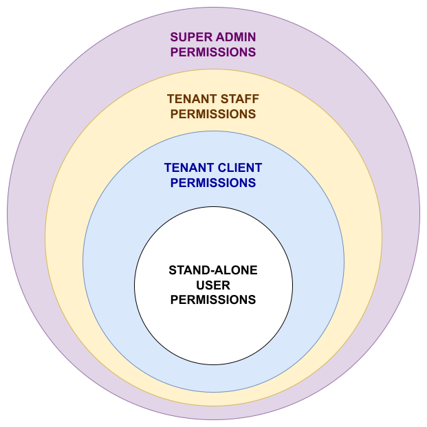

# Authorization on Aru

[`Permissions`](#permissions-framework) and [`user types`](#user-types-and-hierarchy) are used to implement authorization and  restrict access to features and resources on ARU

## Table of Contents

- [Authorization on Aru](#authorization-on-aru)
  - [Table of Contents](#table-of-contents)
  - [Permissions framework](#permissions-framework)
    - [Access restriction on Aru-Server](#access-restriction-on-aru-server)
    - [Access restriction on Aru-Client](#access-restriction-on-aru-client)
  - [User Types and Hierarchy](#user-types-and-hierarchy)
  - [User groups](#user-groups)
  - [Resource wise Access Restriction:](#resource-wise-access-restriction)
    - [Mission](#mission)
      - [User type wise permissions](#user-type-wise-permissions)
      - [Backend access restriction](#backend-access-restriction)
      - [Frontend access restriction](#frontend-access-restriction)
    - [Layer](#layer)
      - [User type wise permissions](#user-type-wise-permissions-1)
      - [Backend access restriction](#backend-access-restriction-1)
      - [Frontend access restriction](#frontend-access-restriction-1)
    - [Base Layer](#base-layer)
      - [User type wise permissions](#user-type-wise-permissions-2)
      - [Backend access restriction](#backend-access-restriction-2)
      - [Frontend access restriction](#frontend-access-restriction-2)
    - [Alert](#alert)
      - [User type wise permissions](#user-type-wise-permissions-3)
      - [Backend access restriction](#backend-access-restriction-3)
      - [Frontend access restriction](#frontend-access-restriction-3)
    - [Asset](#asset)
      - [User type wise permissions](#user-type-wise-permissions-4)
      - [Backend access restriction](#backend-access-restriction-4)
      - [Frontend access restriction](#frontend-access-restriction-4)
    - [Asset Class](#asset-class)
      - [User type wise permissions](#user-type-wise-permissions-5)
      - [Backend access restriction](#backend-access-restriction-5)
      - [Frontend access restriction](#frontend-access-restriction-5)
    - [Client](#client)
      - [User type wise permissions](#user-type-wise-permissions-6)
      - [Backend access restriction](#backend-access-restriction-6)
      - [Frontend access restriction](#frontend-access-restriction-6)
    - [Thread](#thread)
      - [User type wise permissions](#user-type-wise-permissions-7)
      - [Backend access restriction](#backend-access-restriction-7)
      - [Frontend access restriction](#frontend-access-restriction-7)
    - [Document](#document)
      - [User type wise permissions](#user-type-wise-permissions-8)
      - [Backend access restriction](#backend-access-restriction-8)
      - [Frontend access restriction](#frontend-access-restriction-8)
    - [Layer File](#layer-file)
      - [User type wise permissions](#user-type-wise-permissions-9)
      - [Backend access restriction](#backend-access-restriction-9)
      - [Frontend access restriction](#frontend-access-restriction-9)
    - [Flight](#flight)
      - [User type wise permissions](#user-type-wise-permissions-10)
      - [Backend access restriction](#backend-access-restriction-10)
      - [Frontend access restriction](#frontend-access-restriction-10)
    - [Flight Log](#flight-log)
      - [User type wise permissions](#user-type-wise-permissions-11)
      - [Backend access restriction](#backend-access-restriction-11)
      - [Frontend access restriction](#frontend-access-restriction-11)
    - [Location](#location)
      - [User type wise permissions](#user-type-wise-permissions-12)
      - [Backend access restriction](#backend-access-restriction-12)
      - [Frontend access restriction](#frontend-access-restriction-12)
    - [Manufacturer](#manufacturer)
      - [User type wise permissions](#user-type-wise-permissions-13)
      - [Backend access restriction](#backend-access-restriction-13)
      - [Frontend access restriction](#frontend-access-restriction-13)
    - [Mission Type](#mission-type)
      - [User type wise permissions](#user-type-wise-permissions-14)
      - [Backend access restriction](#backend-access-restriction-14)
      - [Frontend access restriction](#frontend-access-restriction-14)
    - [Model](#model)
      - [User type wise permissions](#user-type-wise-permissions-15)
      - [Backend access restriction](#backend-access-restriction-15)
      - [Frontend access restriction](#frontend-access-restriction-15)
    - [Package](#package)
      - [User type wise permissions](#user-type-wise-permissions-16)
      - [Backend access restriction](#backend-access-restriction-16)
      - [Frontend access restriction](#frontend-access-restriction-16)
    - [Tenant](#tenant)
      - [User type wise permissions](#user-type-wise-permissions-17)
      - [Backend access restriction](#backend-access-restriction-17)
      - [Frontend access restriction](#frontend-access-restriction-17)
    - [User](#user)
      - [User type wise permissions](#user-type-wise-permissions-18)
      - [Backend access restriction](#backend-access-restriction-18)
      - [Frontend access restriction](#frontend-access-restriction-18)
    - [User Group](#user-group)
      - [User type wise permissions](#user-type-wise-permissions-19)
      - [Backend access restriction](#backend-access-restriction-19)
      - [Frontend access restriction](#frontend-access-restriction-19)
    - [VOD](#vod)
      - [User type wise permissions](#user-type-wise-permissions-20)
      - [Backend access restriction](#backend-access-restriction-20)
      - [Frontend access restriction](#frontend-access-restriction-20)
    - [Stream Key](#stream-key)
      - [User type wise permissions](#user-type-wise-permissions-21)
      - [Backend access restriction](#backend-access-restriction-21)
      - [Frontend access restriction](#frontend-access-restriction-21)
  - [User type based access restrictions](#user-type-based-access-restrictions)
    - [Dashboard](#dashboard)
    - [Sidebar](#sidebar)
    - [Map](#map)
      - [Frontend access restriction](#frontend-access-restriction-22)
  - [Additional security measures](#additional-security-measures)
  - [Appendix](#appendix)

## Permissions framework

The `permissions` on Aru are represented as `strings` collected together under the `PERMS enum`. The entire list of permissions can be found in the [appendix](#appendix) section at the end of this document.

On successful login, the currently logged in user's data is stored temporarily in: 
- the `res.locals.user` field on the backend (that is accessible to all other express middlewares, including controllers) 
- the `AuthContext` React context at root level in the frontend (that is accessible using `useContext` from all components down the component tree)

During the storage process (on both frontend and backend), based on the [`userType`](#user-types-and-hierarchy) and [`userGroup`](#user-groups) fields, the `customPermissions` field of the 
temporarily stored currently logged in user's data, is populated with permissions. 

This data is then used in different ways to restrict access. 

### Access restriction on Aru-Server

On the backend, the currently logged in user's data is accessed using `res.locals.user`, and an express middleware `PermissionGuard` is attached to routes to restrict users from executing the logic in the related controller, based on the `customPermissions` field.

```typescript
// function signature of PermissionGuard function
function PermissionGuard(...perms: PERMS[])

// usage example
const router = express.Router();
router.post(
  "/route-to-protect",
  isAuthenticated, // middleware that adds res.locals.user and populates customPermissions
  // express-validators (if any)
  PermissionGuard(PERMS.PERMISSION_1,PERMS.PERMISSION_2,PERMS.PERMISSION_3) // sample usage
  // controller for functionality logic related to the route
);
```

If the `customPermissions` field doesn't include all permissions passed to the `PermissionGuard` middleware, a `401` response is sent back and 
execution of controller logic is prevented.

### Access restriction on Aru-Client

On the frontend, the currently logged in user's data is accessed using `useContext` on the `AuthContext`, and the user is restricted from using specific functionality based on the `customPermissions` field. 

```tsx
// structure of Auth in AuthContext
interface IAuth {
  isLoggedIn: boolean;
  userid: string | null;
  userdetails: any;
  isError: boolean;
}

// extracting user from AuthContext
const { Auth } = useContext(AuthContext); // Auth.userdetails will contain currently logged in user's data

// permissions of currently logged in user can be found at Auth.userdetails.customPermissions
```

If the `customPermissions` field doesn't include all permissions needed to perform some functionality, the related UI component is hidden through conditional rendering. If the restriction is set on viewing an entire page, a `401 page component` is conditionally rendered in place of the entire page.

## User Types and Hierarchy

Aru has a role-based user authentication system. Types of users in Aru in decreasing order of power are:

| Sl. No. | User type | Description |
| --- | --- | --- |
| 1 | `super-admin` | Accounts possessed by Kesowa's internal team, They have all permissions existing on the Aru platform. |
| 2 | `tenant-root` | Root level administrative account (singular) of tenant organization, who have signed up to a package on Aru |
| 3 | `tenant-staff` | Staff account(s) for employees of the tenant organization's team |
| 4 | `tenant-client` | Client account(s) for clients of the tenant organization |
| 5 | `standalone-user` | Accounts of inactive or removed users. They have no permissions at all. |



## User groups

Users on Aru can be optionally assigned to a user group. On doing so, the user gains all permissions allowed to that user group. This helps in giving custom sets of permissions to specific set of users. 

Only `tenant-root` and `super-admin` can create such custom user groups; and assign users to them .

## Resource wise Access Restriction:

### Mission

Missions are specific tasks to fulfill the purpose of a tenant organization's project

#### User type wise permissions

| User type | Permissions |
| --- | --- |
| `tenant-client` | `mission_list` | 
| `tenant-staff` | `mission_create`, `mission_update`, `mission_delete` + all client permissions | 
| `tenant-root` | same as above | 
| `super-admin` | same as above | 

#### Backend access restriction

| Permission | Routes protected |
| --- | --- |
| `mission_list`    | `/apis/v1/mission/mission-by-userid` |
|                   | `/apis/v1/mission/get/tenant` |
|                   | `/apis/v1/mission/get/user/:id` |
|                   | `/apis/v1/mission/get/:id` |
|                   | `/apis/v1/mission/filtered-mission` |
|                   | `/apis/v1/mission/get-total-number-of-mission-by-locationID` |
|                   | `/apis/v1/mission/get-missions-by-location-mapref` |
|                   | `/apis/v1/mission/get-missions-by-locationID` |
|                   | `/apis/v1/mission/get-mission-csv-for-tenant-Or-user` |
|                   | `/apis/v1/mission/get-mission-doc-count` |
|                   | `/apis/v1/mission/memory-usage/:id` |
|                   | `/apis/v1/mission/layerfiles/:id` |
|                   | `/apis/v1/mission/:missionID/alerts` |
|                   | `/apis/v1/mission/:missionID/vods` |
|                   | `/apis/v1/baselayer/alerts` |
|                   | `/apis/v1/baselayer/vods` |
|                   | `/apis/v1/client/get-mission-list-for-Id` |
|                   | `/apis/v1/client/get-client-mission-details/:id` |
| `mission_create`  | `/apis/v1/mission/create` |
| `mission_update`  | `/apis/v1/mission/edit` |
|                   | `/apis/v1/mission/update-status` |
|                   | `/apis/v1/mission/insert-missiontype-by-Id` |
|                   | `/apis/v1/client/insert-client-for-mission` |
|                   | `/apis/v1/client/remove-client-from-mission` |
|                   | `/apis/v1/client/invite-client-to-mission` |
|                   | `/apis/v1/flight/assign-pilot` |
| `mission_delete`  | `/apis/v1/mission/delete` |

#### Frontend access restriction

| Permission | Component hidden |
| --- | --- |
| `mission_list`   | `Missions` row in sidebar | 
| `mission_create` | `Create mission` row in sidebar |
|                  | `Add New Mission` button in mission list header |
| `mission_update` | `Edit Details` button in mission details page |
|                  | `Mark for review` / `Mark as completed` button in mission details page |
|                  | `Assign pilot` / `Re-assign` button in mission details page |
|                  | `Assign pilot` modal in mission details page |
| `mission_delete` | `Delete icon` button in `Actions` section of mission list table |

### Layer

Layers are vector or raster entities that can be displayed over a map. Vector layers are represented using geojsons, and each shape in the geojson is called a feature.

#### User type wise permissions

| User type | Permissions |
| --- | --- |
| `tenant-client` | `layer_list`, `feature_list` | 
| `tenant-staff` | `upload_layer`, `edit_layer`, `delete_layer`, `add_feature`, `edit_feature`, `delete_feature` + all client permissions | 
| `tenant-root` | same as above | 
| `super-admin` | same as above | 

#### Backend access restriction

| Permission | Routes protected |
| --- | --- |
| `layer_list`     | `/apis/v1/layer/delete-layers` |
|                  | `/apis/v1/layer/getbymissionId` |
|                  | `/apis/v1/layer/sort-all-layer` |
|                  | `/apis/v1/layer/filter-layer` |
|                  | `/apis/v1/layer/get-feature-csv-by-layerIndex` |
|                  | `/apis/v1/layer/all-layers-for-mission` |
|                  | `/apis/v1/layer/layers-by-missionId/:tenantId/:missionId` |
|                  | `/apis/v1/baselayer/get-meta-data` |
|                  | `/apis/v1/baselayer/get-meta-data-for-update` |
|                  | `/apis/v1/baselayer/all-layers-for-mission` |
|                  | `/apis/v1/baselayer/fetch/:type` |
| `upload_layer`   | `/apis/v1/layer/create/:type` |
|                  | `/apis/v1/layer/create-vector-layer` |
|                  | `/apis/v1/layer/auto-assign-uploaded-image` |
|                  | `/apis/v1/layer/pick-to-map-for-layer` |
|                  | `/apis/v1/layergroup/create` |
| `edit_layer`     | `/apis/v1/layer/edit-layer` |
|                  | `/apis/v1/layer/changecolorbyId` |
|                  | `/apis/v1/layer/set-cover-photo-by-layerFiles-Id` |
|                  | `/apis/v1/layer/assignLayerLabel` |
|                  | `/apis/v1/layer/flag-layer/:layerID` |
|                  | `/apis/v1/layergroup/edit` |
| `delete_layer`   | `/apis/v1/layer/delete` |
|                  | `/apis/v1/layer/delete-layers` |
|                  | `/apis/v1/layergroup/delete` |
|                  | `/apis/v1/layergroup/delete-layerId` |
| `feature_list`   | `/apis/v1/layer/get-files-by-layerId-fIndex` |
|                  | `/apis/v1/layer/get-feature-by-layerId` |
|                  | `/apis/v1/layer/get-feature-csv-by-layerIndex` |
|                  | `/apis/v1/layer/fetch-to-be-reviwed-files` |
|                  | `/apis/v1/layer/add-isReview-to-layerFiles` |
|                  | `/apis/v1/layer/delete-multipleLayerFiles` |
|                  | `/apis/v1/mission/layerfiles/:id` |
| `add_feature`    | `/apis/v1/layer/addFeature` |
|                  | `/apis/v1/layer/auto-assign-uploaded-image` |
|                  | `/apis/v1/layer/pick-to-map-for-layer` |
| `edit_feature`   | `/apis/v1/layer/edit-geojson` |
|                  | `/apis/v1/layer/set-cover-photo-by-layerFiles-Id` |
|                  | `/apis/v1/layer/images-review` |
|                  | `/apis/v1/layer/add-isReview-to-layerFiles` |
|                  | `/apis/v1/layer/flag-feature/:layerID` |
| `delete_feature` | `/apis/v1/layer/delete-geojson` |

#### Frontend access restriction

| Permission | Component hidden |
| --- | --- |
| `upload_layer`   | `Upload` button in mission map sidebar |
|                  | `Save` button in info window after drawing shape on map |
|                  | `Unassign from group` menu item in layer context menu |
|                  | `Group selected layers` menu item in layer context menu |
| `edit_layer`     | `Edit` menu item in layer context menu |
|                  | `Toggle Flag` menu item in layer context menu |
|                  | `Move Selected Layers` menu item in layer context menu |
|                  | `Layer Settings` tab in the drawer opened by `More` option in layer context menu |
| `delete_layer`   | `Delete` menu item in layer context menu |
|                  | `Delete Selected Layers` menu item in layer context menu |
| `edit_feature`   | `Toggle Selected` menu item in `Actions` menu in attribute table of vector layer |
|                  | `Edit icon` corresponding to features in `Actions` column in attribute table |
| `delete_feature` | `Delete icon` corresponding to features in `Actions` column in attribute table |

### Base Layer

Base layers are layers that are added to the base map

#### User type wise permissions

| User type | Permissions |
| --- | --- |
| `tenant-client` | none | 
| `tenant-staff` | `can_create_base_layer`, `can_delete_base_layer`, `can_edit_base_layer`, `can_update_base_layer`, `can_upload_to_base_layer` | 
| `tenant-root` | same as above | 
| `super-admin` | same as above | 

#### Backend access restriction

| Permission | Routes protected |
| --- | --- |
| `can_create_base_layer`    | `/apis/v1/baselayer/create/Vector` |
|                            | `/apis/v1/baselayer/create-by-layers` |
|                            | `/apis/v1/baselayer/create-base-raster-import-mission` |
|                            | `/apis/v1/baselayer/create-base-vector-layer` |
| `can_delete_base_layer`    | `/apis/v1/baselayer/delete-baseLayer-id` |
| `can_edit_base_layer`      | - |
| `can_update_base_layer`    | `/apis/v1/baselayer/set-prime-attr` |
|                            | `/apis/v1/baselayer/update-by-layers` |
|                            | `/apis/v1/baselayer/upload-to-update-base-layer/Vector` |
|                            | `/apis/v1/baselayer/update-base-layer-by-uploaded-layer` |
|                            | `/apis/v1/baselayer/create-base-raster-upload/Raster` |
|                            | `/apis/v1/baselayer/updateRasterLayerUpload/Raster` |
|                            | `/apis/v1/baselayer/updateRasterLayerImport` |
|                            | `/apis/v1/baselayer/publishBaseLayer` |
| `can_upload_to_base_layer` | `/apis/v1/baselayer/upload-to-update-base-layer/Vector` |
|                            | `/apis/v1/baselayer/update-base-layer-by-uploaded-layer` |
|                            | `/apis/v1/baselayer/create-base-raster-upload/Raster` |

#### Frontend access restriction

| Permission | Component hidden |
| --- | --- |
| `can_create_base_layer`    | `Create layer` button in base map sidebar |
|                            | `Unassign from group` menu item in base layer context menu |
|                            | `Group selected layers` menu item in base layer context menu |
| `can_delete_base_layer`    | `Delete` menu item in base layer context menu |
|                            | `Delete Selected Layers` menu item in base layer context menu |
| `can_edit_base_layer`      | `Edit` menu item in base layer context menu |
|                            | `Toggle Flag` menu item in base layer context menu |
|                            | `Move Selected Layers` menu item in base layer context menu |
| `can_update_base_layer`    | `Update layer` menu item in base layer context menu |
|                            | `Layer Settings` tab in the drawer opened by `More` option in base layer context menu |
| `can_upload_to_base_layer` | `Dragger` UI component for uploading images in base layer `Attachments` drawer |
|                            | `Upload to features` button in the drawer opened by `More` option in base layer context menu |

### Alert

Alerts (or Outcomes) are entities representing images containing geospatial data like coordinates and address

#### User type wise permissions

| User type | Permissions |
| --- | --- |
| `tenant-client` | `alert_list` | 
| `tenant-staff` | `alert_create`, `alert_delete`, `alert_update` + all client permissions | 
| `tenant-root` | same as above | 
| `super-admin` | same as above | 

#### Backend access restriction

| Permission | Routes protected |
| --- | --- |
| `alert_list`   | `/apis/v1/alert/get-alerts-by-flight-or-location-ID` |
|                | `/apis/v1/alert/get-alert-by-ID` |
|                | `/apis/v1/alert/get-alerts-by-location-ID` |
|                | `/apis/v1/alert/get-alert-by-location-ID-and-time` |
|                | `/apis/v1/alert/get-number-of-alerts-By-location-ID` |
|                | `/apis/v1/alert/get-alerts-By-mission-ID` |
|                | `/apis/v1/alert/get-alerts-By-location-id-pagination` |
|                | `/apis/v1/alert/get-alerts-by-mission-mapref` |
|                | `/apis/v1/alert/get-alerts-by-tenantid` |
|                | `/apis/v1/alert/get-alerts-by-tenantid-advanced-result` |
|                | `/apis/v1/alert/delete-multiple-alerts` |
|                | `/apis/v1/alert/update-multi-alert-by-ID` |
|                | `/apis/v1/baselayer/alerts` |
|                | `/apis/v1/mission/:missionID/alerts` |
| `alert_create` | `/apis/v1/alert/create` |
|                | `/apis/v1/alert/manual-upload-alert` |
| `alert_delete` | `/apis/v1/alert/delete-multiple-alerts` |
| `alert_update` | `/apis/v1/alert/update-alert-by-ID` |
|                | `/apis/v1/alert/update-multi-alert-by-ID` |

#### Frontend access restriction

| Permission | Component hidden |
| --- | --- |
| `alert_create` | `Upload` menu item in `Actions` dropdown menu in `Outcomes` tab in mission details page |
| `alert_delete` | `Delete` menu item in alert context menu |
|                | `Delete files` menu item in `Actions` dropdown menu in `Outcomes` tab in mission details page |
| `alert_update` | `Flag` / `Unflag` menu item in alert context menu |
|                | `Flag` / `Unflag` icon in `Outcomes` tab in mission details page |

### Asset

Assets are entities representing individual drones owned by the organization. Each drone / asset has an asset class, model and manufacturer associated with it.

#### User type wise permissions

| User type | Permissions |
| --- | --- |
| `tenant-client` | `asset_list` | 
| `tenant-staff` | `asset_create`, `asset_delete`, `asset_update` + all client permissions | 
| `tenant-root` | same as above | 
| `super-admin` | same as above | 

#### Backend access restriction

| Permission | Routes protected |
| --- | --- |
| `asset_list`   | `/apis/v1/asset/get` |
|                | `/apis/v1/asset/get-all-asset` |
| `asset_create` | `/apis/v1/asset/create` |
| `asset_delete` | `/apis/v1/asset/delete` |
| `asset_update` | `/apis/v1/asset/update` |
|                | `/apis/v1/asset/toggle-asset-status` |

#### Frontend access restriction

| Permission | Component hidden |
| --- | --- |
| `asset_list` | `Assets` row in sidebar |

### Asset Class

Asset classes are entities representing categories into which the asset drones can be split.

#### User type wise permissions

| User type | Permissions |
| --- | --- |
| `tenant-client` | `asset_class_list` | 
| `tenant-staff` | same as above | 
| `tenant-root` | same as above | 
| `super-admin` | `asset_class_create`, `asset_class_delete`, `asset_class_update` + all tenant-root permissions | 

#### Backend access restriction

| Permission | Routes protected |
| --- | --- |
| `asset_class_list`   | `/apis/v1/assetclass/get` |
|                      | `/apis/v1/assetclass/get-asset-class-by-id` |
| `asset_class_create` | `/apis/v1/assetclass/create` |
| `asset_class_delete` | `/apis/v1/assetclass/delete` |
| `asset_class_update` | `/apis/v1/assetclass/update` |

#### Frontend access restriction

No restrictions based on these permissions

### Client

Clients are user entities having `userType` field equal to `tenant-client`. They represent accounts of users who are clients of the tenant organization.
The `tenant-root` user or `tenant-staff` users create such accounts to let the tenant's clients access their missions and data on Aru platform. 

#### User type wise permissions

| User type | Permissions |
| --- | --- |
| `tenant-client` | `client_list` | 
| `tenant-staff` | `client_data`, `create_client`, `delete_client`, `edit_client` + all tenant-client permissions | 
| `tenant-root` | same as above | 
| `super-admin` | same as above | 

#### Backend access restriction

| Permission | Routes protected |
| --- | --- |
| `client_list`   | `/apis/v1/client/get-list-client` |
|                 | `/apis/v1/client/geneate-client-csv` |
|                 | `/apis/v1/client/get-client-by-email` |
|                 | `/apis/v1/client/get-client-by-id` |
| `client_data`   | - |
| `create_client` | `/apis/v1/client/create` |
|                 | `/apis/v1/client/insert-client-for-mission` |
|                 | `/apis/v1/client/remove-client-from-mission` |
|                 | `/apis/v1/client/invite-client-to-mission`|
| `delete_client` | `/apis/v1/client/delete-client` |
| `edit_client`   | `/apis/v1/client/edit-client-details` |
|                 | `/apis/v1/client/insert-client-for-mission` |
|                 | `/apis/v1/client/remove-client-from-mission` |
|                 | `/apis/v1/client/invite-client-to-mission` |

#### Frontend access restriction

| Permission | Component hidden |
| --- | --- |
| `client_list`   | `Client List` row in sidebar |
|                 | `List Client` button in mission listing by client page |
| `client_data`   | `Client Data` row in sidebar |
| `create_client` | `Create Client` row in sidebar |
|                 | `Create Client` button in client listing page |
|                 | Client creation page (`401` page rendered instead) |
| `delete_client` | `Delete icon` button in `Actions` section of client list table |
| `edit_client`   | `Edit icon` button in `Actions` section of client list table |
|                 | Client edit page (`401` page rendered instead) |
|                 | Client password changing page (`401` page rendered instead) |

### Thread

Threads are entities representing comments and comment threads that can be added or attached to various entities like images, layers, alerts, etc.

#### User type wise permissions

| User type | Permissions |
| --- | --- |
| `tenant-client` | none | 
| `tenant-staff` | `thread_create`, `thread_list`, `thread_update` | 
| `tenant-root` | same as above | 
| `super-admin` | same as above | 

#### Backend access restriction

| Permission | Routes protected |
| --- | --- |
| `thread_create` | `/apis/v1/thread/:docType/:docId` |
| `thread_list`   | `/apis/v1/thread/:docType/:docId` |
| `thread_update` | `/apis/v1/thread/:docType/:docId` |

#### Frontend access restriction

No restrictions based on these permissions

### Document

Documents are entities representing any kind of general files uploaded to and associated with a mission

#### User type wise permissions

| User type | Permissions |
| --- | --- |
| `tenant-client` | `list_document` | 
| `tenant-staff` | `upload_document`, `update_document`, `delete_document` + all client permissions | 
| `tenant-root` | same as above | 
| `super-admin` | same as above | 

#### Backend access restriction

| Permission | Routes protected |
| --- | --- |
| `list_document`   | `/apis/v1/document/delete-multiple` |
|                   | `/apis/v1/document/getbymissionId` |
|                   | `/apis/v1/document/getImagesByMissionId` |
|                   | `/apis/v1/document/zipbyId` |
|                   | `/apis/v1/document/update-multi-docs-by-ID` |
| `upload_document` | `/apis/v1/document/create` |
|                   | `/apis/v1/report/block` |
|                   | `/apis/v1/report/plot` |
| `update_document` | `/apis/v1/document/update-doc-by-ID` |
|                   | `/apis/v1/document/update-multi-docs-by-ID` |
| `delete_document` | `/apis/v1/document/delete` |
|                   | `/apis/v1/document/delete-multiple` |

#### Frontend access restriction

| Permission | Component hidden |
| --- | --- |
| `upload_document` | `Upload files` menu item in `Actions` dropdown menu in `Documents` tab in mission details page |
|                   | `Upload` button in `Images` tab in mission details page |
|                   | `Report Generation` tab in mission details page |
| `update_document` | `Flag` / `Unflag` menu item in image context menu |
|                   | `Flag` / `Unflag` icon in `Images` tab in mission details page |
| `delete_document` | `Delete files` menu item in `Actions` dropdown menu in `Documents` tab in mission details page |
|                   | `Delete files` menu item in `Actions` dropdown menu in `Images` tab in mission details page |
|                   | `Delete Image` menu item in image context menu |

### Layer File

Layer files are entities representing images or other document files attached to an entire layer or some specific geojson features of a vector layer

#### User type wise permissions

| User type | Permissions |
| --- | --- |
| `tenant-client` | none | 
| `tenant-staff` | `feature_file_upload`, `feature_file_delete` | 
| `tenant-root` | same as above | 
| `super-admin` | same as above | 

#### Backend access restriction

| Permission | Routes protected |
| --- | --- |
| `feature_file_upload` | `/apis/v1/layer/upload-file-to-layer` |
|                       | `/apis/v1/layer/upload-file-geojson` |
|                       | `/apis/v1/layer/auto-assign-uploaded-image` |
|                       | `/apis/v1/layer/images-review` |
|                       | `/apis/v1/layer/fetch-to-be-reviwed-files` |
|                       | `/apis/v1/layer/pick-to-map-for-layer` |
| `feature_file_delete` | `/apis/v1/layer/delete-file-geojson` |
|                       | `/apis/v1/layer/delete-geojson` |
|                       | `/apis/v1/layer/delete-multipleLayerFiles` |

#### Frontend access restriction

| Permission | Component hidden |
| --- | --- |
| `feature_file_upload` | `Dragger` UI component for uploading images in layer `Attachments` drawer |
|                       | `Upload to features` button in the drawer opened by `More` option in layer context menu |
| `feature_file_delete` | `Delete` menu item in context menu of images in layer's `Attachments` drawer `Media` tab |
|                       | `Delete` button corresponding to documents in layer's `Attachments` drawer `Documents` tab |
|                       | `Delete` menu item in context menu of images in layer's `More` drawer `Media` tab |
|                       | `Delete` button corresponding to documents in layer's `More` drawer `Documents` tab |

### Flight

Flights are entities representing drone flight schedules for gathering data for a mission.

#### User type wise permissions

| User type | Permissions |
| --- | --- |
| `tenant-client` | none | 
| `tenant-staff` | `flight_create`, `flight_delete`, `flight_list`, `flight_update` | 
| `tenant-root` | same as above | 
| `super-admin` | same as above | 

#### Backend access restriction

| Permission | Routes protected |
| --- | --- |
| `flight_create` | `/apis/v1/flight/create` |
| `flight_delete` | `/apis/v1/flight/delete` |
| `flight_list`   | `/apis/v1/flight/mission-specific-view` |
|                 | `/apis/v1/flight/get-flight-by-location-ID` |
| `flight_update` | `/apis/v1/flight/edit` |
|                 | `/apis/v1/flight/assign-pilot-self` |
|                 | `/apis/v1/flight/assign-pilot` |

#### Frontend access restriction

| Permission | Component hidden |
| --- | --- |
| `flight_update` | `Edit` option in context menu of flight in mission details page |

### Flight Log

Flight logs are entities representing the log files generated by the drones during their scheduled flights.

#### User type wise permissions

| User type | Permissions |
| --- | --- |
| `tenant-client` | none | 
| `tenant-staff` | `flight_log_create`, `flight_log_delete`, `flight_log_list`, `flight_log_update` | 
| `tenant-root` | same as above | 
| `super-admin` | same as above | 

#### Backend access restriction

| Permission | Routes protected |
| --- | --- |
| `flight_log_create` | `/apis/v1/flightlog/create` |
|                     | `/apis/v1/flightlog/get` |
|                     | `/apis/v1/flightlog/last-flightlog-by-ID` |
|                     | `/apis/v1/flightlog/last-flightlog-by-location-ID` |
| `flight_log_delete` | - |
| `flight_log_list` | - |
| `flight_log_update` | - |

#### Frontend access restriction

No restrictions based on these permissions

### Location

Locations are entities representing important locations on the map that are used across multiple missions or during scheduling files.

#### User type wise permissions

| User type | Permissions |
| --- | --- |
| `tenant-client` | none | 
| `tenant-staff` | `location_create`, `location_delete`, `location_list`, `location_update` | 
| `tenant-root` | same as above | 
| `super-admin` | same as above | 

#### Backend access restriction

| Permission | Routes protected |
| --- | --- |
| `location_create` | `/apis/v1/location/create` |
| `location_delete` | `/apis/v1/location/delete` |
| `location_list`   | `/apis/v1/location/get` |
|                   | `/apis/v1/location/get-within-by-id` |
|                   | `/apis/v1/location/get-by-id` |
|                   | `/apis/v1/location/get-locationID-By-lat-long` |
| `location_update` | `/apis/v1/location/update` |

#### Frontend access restriction

No restrictions based on these permissions

### Manufacturer

Manufacturers are entities representing the manufacturer companies of the drone assets.

#### User type wise permissions

| User type | Permissions |
| --- | --- |
| `tenant-client` | none | 
| `tenant-staff` | `manufacturer_create`, `manufacturer_delete`, `manufacturer_list`, `manufacturer_update` | 
| `tenant-root` | same as above | 
| `super-admin` | same as above | 

#### Backend access restriction

| Permission | Routes protected |
| --- | --- |
| `manufacturer_create` | `/apis/v1/manufacturer/create` |
| `manufacturer_delete` | `/apis/v1/manufacturer/delete` |
| `manufacturer_list`   | `/apis/v1/manufacturer/get` |
|                       | `/apis/v1/manufacturer/get-by-id` |
| `manufacturer_update` | `/apis/v1/manufacturer/update` |

#### Frontend access restriction

No restrictions based on these permissions

### Mission Type

Mission types are entities representing types of missions supported by Aru, and their related features / data. Currently Aru supports two types of missions: `Surveillance` and `Mapping`. Only `super-admin` users are allowed to modify, add or delete mission types.

#### User type wise permissions

| User type | Permissions |
| --- | --- |
| `tenant-client` | none | 
| `tenant-staff` | none | 
| `tenant-root` | none | 
| `super-admin` | `mission_type_list`, `mission_type_create`, `mission_type_update`, `mission_type_delete` | 

#### Backend access restriction

| Permission | Routes protected |
| --- | --- |
| `mission_type_list`   | `/apis/v1/missiontype/getall` |
| `mission_type_create` | `/apis/v1/missiontype/create` |
| `mission_type_update` | `/apis/v1/mission/insert-missiontype-by-Id` |
|                       | `/apis/v1/missiontype/edit` |
| `mission_type_delete` | `/apis/v1/missiontype/delete` |

#### Frontend access restriction

No restrictions based on these permissions

### Model

Models are entities representing the model name and related information of a drone asset.

#### User type wise permissions

| User type | Permissions |
| --- | --- |
| `tenant-client` | none | 
| `tenant-staff` | `model_create`, `model_delete`, `model_list`, `model_update` | 
| `tenant-root` | same as above | 
| `super-admin` | same as above | 

#### Backend access restriction

| Permission | Routes protected |
| --- | --- |
| `model_create` | `/apis/v1/model/create` |
| `model_delete` | `/apis/v1/model/delete` |
| `model_list`   | `/apis/v1/model/get` |
|                | `/apis/v1/model/get-by-id` |
| `model_update` | `/apis/v1/model/update` |

#### Frontend access restriction

No restrictions based on these permissions

### Package

Packages are the way of grouping services provided by Aru. Tenant organizations subscribe to packages on Aru to be able to execute missions and store data on the platform. Every package has different storage limits, prices and services associated with it.

#### User type wise permissions

| User type | Permissions |
| --- | --- |
| `tenant-client` | none | 
| `tenant-staff` | none | 
| `tenant-root` | none | 
| `super-admin` | `package_create`, `package_list`, `package_update` | 

#### Backend access restriction

| Permission | Routes protected |
| --- | --- |
| `package_create` | `/apis/v1/package/create` |
| `package_list`   | `/apis/v1/package/fetchall` |
|                  | `/apis/v1/package/fetch-by-id` |
|                  | `/apis/v1/package/fetchactive` |
|                  | `/apis/v1/tenant/fetch-active-package-public` |
| `package_update` | `/apis/v1/package/edit-package-for-Id` |

#### Frontend access restriction

No restrictions based on these permissions

### Tenant

Tenants are entities representing a tenant organization. All data related to the organization itself is stored in such entities, and they are referenced by the tenant root account and all tenant staff and client accounts.

#### User type wise permissions

| User type | Permissions |
| --- | --- |
| `tenant-client` | none | 
| `tenant-staff` | none | 
| `tenant-root` | `tenant_list_self`, `tenant_update_self` | 
| `super-admin` | `tenant_create`, `tenant_delete`, `tenant_list`, `tenant_update` | 

#### Backend access restriction

| Permission | Routes protected |
| --- | --- |
| `tenant_list_self`   | `/apis/v1/organisation/fetch-organisation-details` |
| `tenant_update_self` | `/apis/v1/organisation/update-organisation-details` |
|                      | `/apis/v1/organisation/request-otp-for-email-change` |
|                      | `/apis/v1/organisation/resend-otp-for-email-change` |
|                      | `/apis/v1/organisation/validate-otp-update-email` |
| `tenant_create`      | `/apis/v1/tenant/create` |
| `tenant_delete`      | `/apis/v1/tenant/delete-tenant` |
| `tenant_list`        | `/apis/v1/organisation/fetch-organisation-details` |
|                      | `/apis/v1/tenant/fetchall` |
|                      | `/apis/v1/tenant/fetch-tenant-details` |
| `tenant_update`      | `/apis/v1/organisation/update-organisation-details` |
|                      | `/apis/v1/organisation/request-otp-for-email-change` |
|                      | `/apis/v1/organisation/resend-otp-for-email-change` |
|                      | `/apis/v1/organisation/validate-otp-update-email` |
|                      | `/apis/v1/tenant/add-initial-package` |
|                      | `/apis/v1/tenant/edit-tenant` |
|                      | `/apis/v1/tenant/add-all-count-to-tenant` |
|                      | `/apis/v1/tenant/add-actualSize-to-tenant` |
|                      | `/apis/v1/tenant/delete-tenant` |
|                      | `/apis/v1/tenant/updatepublicMapRef` |

#### Frontend access restriction

No restrictions based on these permissions

### User

Users are entities representing user accounts on Aru. It is the cornerstone of authentication, containing user credentials and password. Users can be of four types as [mentioned above](#user-types-and-hierarchy)

#### User type wise permissions

| User type | Permissions |
| --- | --- |
| `tenant-client` | none | 
| `tenant-staff` | `user_create`, `user_list`, `user_update` | 
| `tenant-root` | `user_delete` + all tenant-staff permissions | 
| `super-admin` | same as above | 

#### Backend access restriction

| Permission | Routes protected |
| --- | --- |
| `user_create` | - |
| `user_list`   | `/apis/v1/user/fetch-all-user` |
|               | `/apis/v1/user/fetch-user-by-id` |
| `user_update` | `/apis/v1/user/edit-user` |
| `user_delete` | `/apis/v1/user/delete-user` |

#### Frontend access restriction

| Permission | Component hidden |
| --- | --- |
| `user_create` | `Create user` row in sidebar |
| `user_list`   | `User list` row in sidebar |

### User Group

User groups are entities representing the concept user groups [mentioned above](#user-groups)

#### User type wise permissions

| User type | Permissions |
| --- | --- |
| `tenant-client` | none | 
| `tenant-staff` | `user_group_list`  | 
| `tenant-root` | `user_group_create`, `user_group_delete`, `user_group_update` + all tenant-staff permissions | 
| `super-admin` | same as above | 

#### Backend access restriction

| Permission | Routes protected |
| --- | --- |
| `user_group_list`   | `/apis/v1/usergroup/tenant-usergroup-list` |
|                     | `/apis/v1/usergroup/tenant-usergroup-by-id` |
| `user_group_create` | `/apis/v1/usergroup/tenant-usergroup-create` |
| `user_group_delete` | `/apis/v1/usergroup/tenant-usergroup-delete` |
| `user_group_update` | `/apis/v1/usergroup/tenant-usergroup-edit` |

#### Frontend access restriction

No restrictions based on these permissions

### VOD

VODs (Video On Demand) are entities representing videos related to a specific mission. These include both videos uploaded by users and videos captured by drones. The former may or may not contain geospatial data but the later always contain geospatial data associated with them.

#### User type wise permissions

| User type | Permissions |
| --- | --- |
| `tenant-client` | `vod_list` | 
| `tenant-staff` | `vod_create`, `vod_delete`, `vod_update` + all client permissions | 
| `tenant-root` | same as above | 
| `super-admin` | same as above | 

#### Backend access restriction

| Permission | Routes protected |
| --- | --- |
| `vod_list`   | `/apis/v1/baselayer/vods` |
|              | `/apis/v1/mission/:missionID/vods` |
|              | `/apis/v1/vod/get-by-ID` |
|              | `/apis/v1/vod/get-by-missionID` |
|              | `/apis/v1/vod/get-count-by-missionID` |
|              | `/apis/v1/vod/get-by-flightID` |
|              | `/apis/v1/vod/get-by-location-ID` |
|              | `/apis/v1/vod/delete-multi-by-ID` |
|              | `/apis/v1/vod/update-multi-vod-by-ID` |
| `vod_create` | `/apis/v1/vod/save-vod-manual` |
| `vod_delete` | `/apis/v1/vod/delete-by-ID` |
|              | `/apis/v1/vod/delete-multi-by-ID` |
| `vod_update` | `/apis/v1/vod/edit-by-ID` |
|              | `/apis/v1/vod/update-vod-by-ID` |
|              | `/apis/v1/vod/update-multi-vod-by-ID` |

#### Frontend access restriction

| Permission | Component hidden |
| --- | --- |
| `vod_create` | `Upload` button in `Videos` tab in mission details page |
| `vod_update` | `Flag` / `Unflag` menu item in vod context menu |
|              | `Rename` menu item in vod context menu |
| `vod_delete` | `Delete video` menu item in vod context menu |
|              | `Delete files` menu item in `Actions` dropdown menu in `Videos` tab in mission details page|

### Stream Key

Stream keys are entities representing live WebRTC streams on Aru, that can used to view the live video feed captured by the drone during its flight.

#### User type wise permissions

| User type | Permissions |
| --- | --- |
| `tenant-client` | none | 
| `tenant-staff` | `stream_create`, `stream_delete`, `stream_list` | 
| `tenant-root` | same as above | 
| `super-admin` | same as above | 

#### Backend access restriction

| Permission | Routes protected |
| --- | --- |
| `stream_create` | `/apis/v1/streamtoken/gen-stream-token` |
| `stream_delete` | `/apis/v1/streamtoken/remove-token` |
| `stream_list`   | `/apis/v1/streamtoken/get-active-streams` |
|                 | `/apis/v1/streamtoken/get-active-stream/flight` |

#### Frontend access restriction

No restrictions based on these permissions

## User type based access restrictions

### Dashboard

Dashboard is a frontend page from which other features can be accessed. It is the first page displayed after successful login. The tenant organization's storage statistics is displayed on the dashboard for `tenant-root` and `tenant-staff` type users. Based on the type of user, following other buttons are available on the dashboard:

| User Type | Dashboard Components |
| --- | --- |
| `tenant-client` | `Missions` |
| `tenant-staff`  | `Create Mission` |
|                 | `Missions` |
|                 | `User list` |
|                 | `Client list` |
|                 | `Connect to app` |
| `tenant-root`   | `Create Mission` |
|                 | `Missions` |
|                 | `Users` |
|                 | `User groups` |
|                 | `Data` |
|                 | `Connect to app` |
| `super-admin`   | No other options |

### Sidebar

Sidebar is a frontend component from which other features can be accessed. It is fixed and always present on the left side of screen irrespective of frontend routes. Based on the type of user, different rows are displayed in the sidebar.

| User Type | Sidebar Rows |
| --- | --- |
| `tenant-client` | `Missions` |
|                 | `Connect to App` |
| `tenant-staff`  | `Create Mission` |
|                 | `Missions` |
|                 | `User list` |
|                 | `Client list` |
| `tenant-root`   | `Dashboard` |
|                 | `My Account` |
|                 | `Missions` |
|                 | `User > Create user` |
|                 | `User > User list` |
|                 | `Client > Create client` |
|                 | `Client > Client list` |
|                 | `Client > Missions` |
|                 | `User groups > Create user group` |
|                 | `User groups > User group list` |
|                 | `Data` |
|                 | `Map` |
|                 | `Control Center` |
|                 | `Assets` |
| `super-admin`   | `Tenant > Tenant list` |
|                 | `Tenant > Tenant create` |
|                 | `Package > Create package` |
|                 | `Package > Package list` |

### Map

Maps are frontend components used to display geospatial components and layers overlayed on top of a map. The types of maps in Aru and their visibility are listed below.

#### Frontend access restriction

| Map type | Visibility |
| --- | --- |
| `Public map` | This map is visible to anyone who has its link. They need not be a user of Aru. |
| `Mission map` | This map corresponds to missions. `tenant-root` and `tenant-staff` can access all missions of the tenant organization, and hence thier maps. `tenant-client` can access the maps of only the missions to which they have been added. |
| `Base map` | This map can be accessed by the `tenant-root` and `tenant-staff` but not by `tenant-client`s. |

## Additional security measures

The following other scenarios have been ensured on the Aru application:

1. During fetching of media items, layers and other entities related to a mission, it is ensured that a `tenantId` and `userId` are included in the MongoDB query so that one `tenant-root` or the `tenant-staff`s and `tenant-client`s under them can never access the missions or related entities of another `tenant-root`.

2. Clients under a tenant can view the list of other clients under the same tenant, but can't edit or delete them

3. Clients under a tenant can not view the list of staff under the same tenant 

4. Staff under a tenant can view the list of other staff under the same tenant, but can't edit or delete them

5. Staff under a tenant can view the list of clients under the same tenant, but can't edit or delete them UNLESS given permission by `tenant-root` (through user groups)

6. Tenant root can edit the details as well as password of any staff or client users under them anytime

## Appendix

List of all permissions included in the `PERM enum` on `aru`

```
export enum PERMS {
  ADD_FEATURE = "add_feature",
  ALERT_CREATE = "alert_create",
  ALERT_DELETE = "alert_delete",
  ALERT_LIST = "alert_list",
  ALERT_UPDATE = "alert_update",
  ASSET_CLASS_CREATE = "asset_class_create",
  ASSET_CLASS_DELETE = "asset_class_delete",
  ASSET_CLASS_LIST = "asset_class_list",
  ASSET_CLASS_UPDATE = "asset_class_update",
  ASSET_CREATE = "asset_create",
  ASSET_DELETE = "asset_delete",
  ASSET_LIST = "asset_list",
  ASSET_UPDATE = "asset_update",
  CAN_CREATE_BASE_LAYER = "can_create_base_layer",
  CAN_DELETE_BASE_LAYER = "can_delete_base_layer",
  CAN_EDIT_BASE_LAYER = "can_edit_base_layer",
  CAN_UPDATE_BASE_LAYER = "can_update_base_layer",
  CAN_UPLOAD_TO_BASE_LAYER = "can_upload_to_base_layer",
  CLIENT_DATA = "client_data",
  CLIENT_LIST = "client_list",
  COMMENT_DELETE = "comment_delete",
  CREATE_CLIENT = "create_client",
  DASHBOARD = "dashboard",
  DATA_PAGE = "data_page",
  DELETE_CLIENT = "delete_client",
  DELETE_DOCUMENT = "delete_document",
  DELETE_FEATURE = "delete_feature",
  DELETE_LAYER = "delete_layer",
  DOWNLOAD_LAYER = "download_layer",
  EDIT_CLIENT = "edit_client",
  EDIT_FEATURE = "edit_feature",
  EDIT_LAYER = "edit_layer",
  FEATURE_FILE_DELETE = "feature_file_delete",
  FEATURE_FILE_UPLOAD = "feature_file_upload",
  FEATURE_LIST = "feature_list",
  FLIGHT_CREATE = "flight_create",
  FLIGHT_DELETE = "flight_delete",
  FLIGHT_LIST = "flight_list",
  FLIGHT_LOG_CREATE = "flight_log_create",
  FLIGHT_LOG_DELETE = "flight_log_delete",
  FLIGHT_LOG_LIST = "flight_log_list",
  FLIGHT_LOG_UPDATE = "flight_log_update",
  FLIGHT_UPDATE = "flight_update",
  LAYER_LIST = "layer_list",
  LIST_DOCUMENT = "list_document",
  LOCATION_CREATE = "location_create",
  LOCATION_DELETE = "location_delete",
  LOCATION_LIST = "location_list",
  LOCATION_UPDATE = "location_update",
  MANUFACTURER_CREATE = "manufacturer_create",
  MANUFACTURER_DELETE = "manufacturer_delete",
  MANUFACTURER_LIST = "manufacturer_list",
  MANUFACTURER_UPDATE = "manufacturer_update",
  MISSION_CREATE = "mission_create",
  MISSION_DELETE = "mission_delete",
  MISSION_LIST = "mission_list",
  MISSION_TYPE_CREATE = "mission_type_create",
  MISSION_TYPE_DELETE = "mission_type_delete",
  MISSION_TYPE_LIST = "mission_type_list",
  MISSION_TYPE_UPDATE = "mission_type_update",
  MISSION_UPDATE = "mission_update",
  MODEL_CREATE = "model_create",
  MODEL_DELETE = "model_delete",
  MODEL_LIST = "model_list",
  MODEL_UPDATE = "model_update",
  OTP_EMAIL_SEND = "otp_email_send",
  PACKAGE_CREATE = "package_create",
  PACKAGE_DELETE = "package_delete",
  PACKAGE_LIST = "package_list",
  PACKAGE_UPDATE = "package_update",
  PUBLIC_MAP_CREATE = "public_map_create",
  SET_COVER_PHOTO = "set_cover_photo",
  STREAM_CREATE = "stream_create",
  STREAM_DELETE = "stream_delete",
  STREAM_LIST = "stream_list",
  TENANT_CREATE = "tenant_create",
  TENANT_DELETE = "tenant_delete",
  TENANT_LIST_SELF = "tenant_list_self",
  TENANT_LIST = "tenant_list",
  TENANT_UPDATE_SELF = "tenant_update_self",
  TENANT_UPDATE = "tenant_update",
  THREAD_CREATE = "thread_create",
  THREAD_LIST = "thread_list",
  THREAD_UPDATE = "thread_update",
  UPDATE_DOCUMENT = "update_document",
  UPLOAD_DOCUMENT = "upload_document",
  UPLOAD_LAYER = "upload_layer",
  USER_CREATE = "user_create",
  USER_DELETE = "user_delete",
  USER_GROUP_CREATE = "user_group_create",
  USER_GROUP_DELETE = "user_group_delete",
  USER_GROUP_LIST = "user_group_list",
  USER_GROUP_UPDATE = "user_group_update",
  USER_LIST = "user_list",
  USER_UPDATE = "user_update",
  VOD_CREATE = "vod_create",
  VOD_DELETE = "vod_delete",
  VOD_LIST = "vod_list",
  VOD_UPDATE = "vod_update",
  WEBRTC_VIEW = "webrtc_view",
}
```