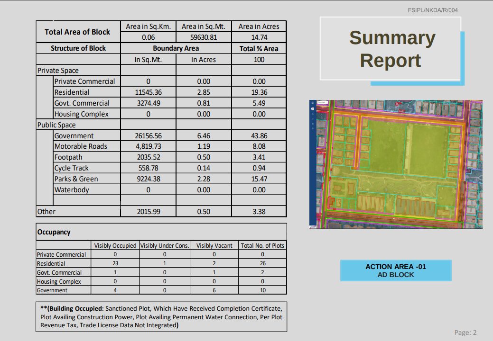
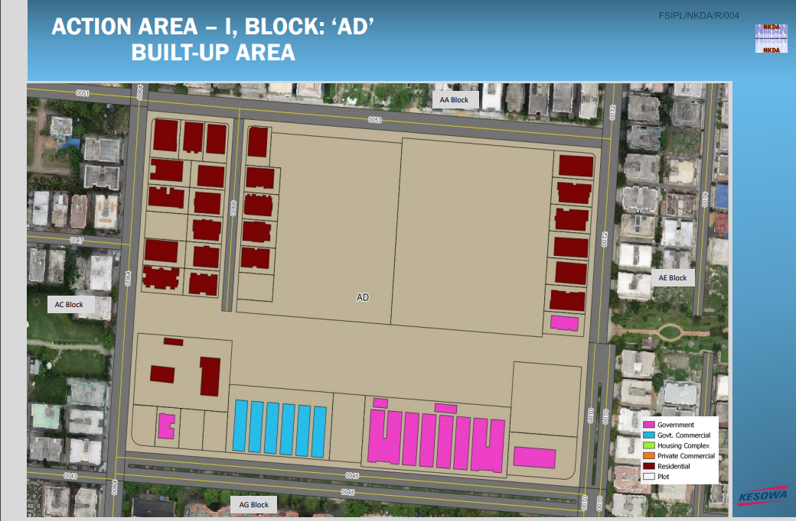
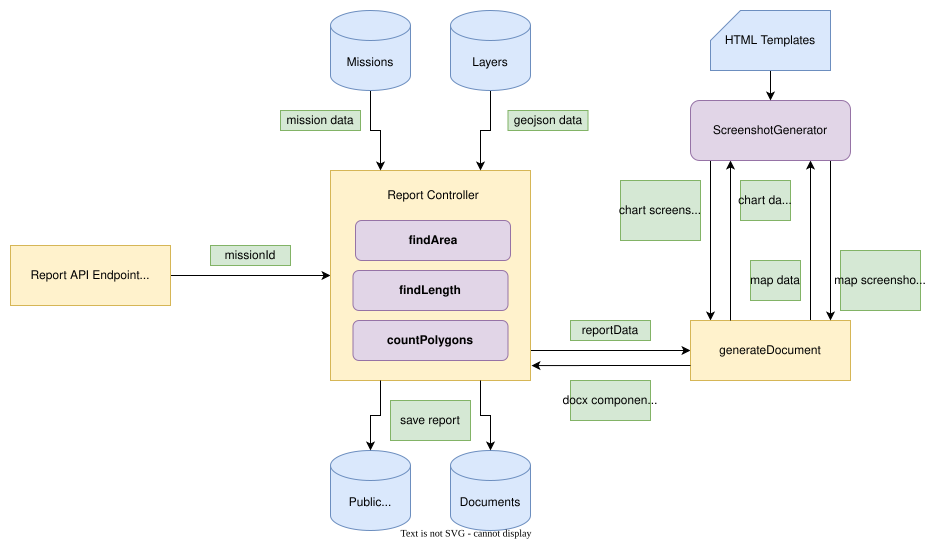
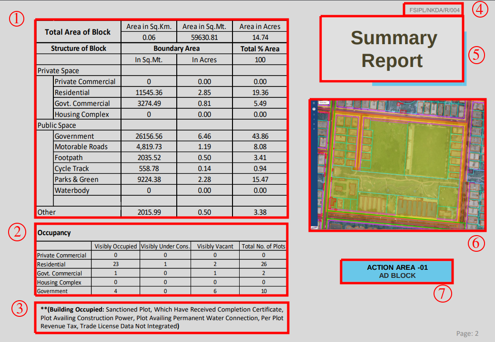
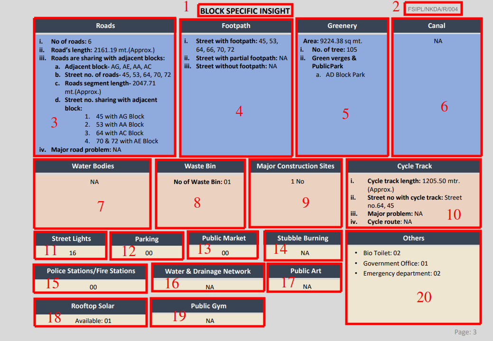
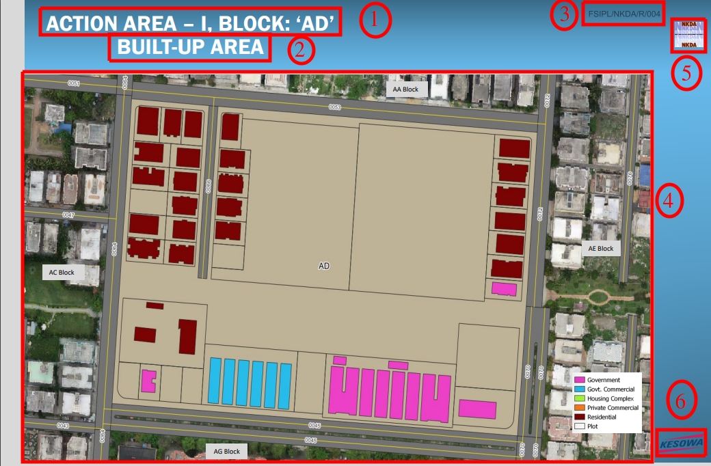

# Block Report Generation on Aru

The Block Report is a document containing information about a block.

## Table of Contents

- [Block Report Generation on Aru](#block-report-generation-on-aru)
  - [Table of Contents](#table-of-contents)
  - [Structure of Block Report](#structure-of-block-report)
  - [Pre-requisites](#pre-requisites)
  - [Overview](#overview)
  - [Utilities](#utilities)
    - [GeoJSON Utilities](#geojson-utilities)
    - [Screenshot (or Image Generation) Utilities](#screenshot-or-image-generation-utilities)
    - [Report Utilities](#report-utilities)
    - [Pre-defined Categories](#pre-defined-categories)
      - [Following is the current list of pre-defined area categories and associated vectorTypes:](#following-is-the-current-list-of-pre-defined-area-categories-and-associated-vectortypes)
      - [Following is the current list of pre-defined occupancy categories and associated vectorTypes:](#following-is-the-current-list-of-pre-defined-occupancy-categories-and-associated-vectortypes)
      - [Following is the current list of pre-defined deliverable types and associated vectorTypes:](#following-is-the-current-list-of-pre-defined-deliverable-types-and-associated-vectortypes)
  - [Generating Cover Page](#generating-cover-page)
    - [Identifying Major Components](#identifying-major-components)
    - [Structure of Data Required](#structure-of-data-required)
    - [Gathering the Data](#gathering-the-data)
  - [Generating Summary Page](#generating-summary-page)
    - [Identifying Major Components](#identifying-major-components-1)
    - [Structure of Data Required](#structure-of-data-required-1)
      - [**IAreaDesc:**](#iareadesc)
      - [**IOccupancyDesc:**](#ioccupancydesc)
      - [**IAreaData:**](#iareadata)
    - [Gathering the Data](#gathering-the-data-1)
  - [Generating Insights Page](#generating-insights-page)
    - [Identifying Major Components](#identifying-major-components-2)
    - [Structure of Data Required](#structure-of-data-required-2)
      - [**IDetailDesc**](#idetaildesc)
    - [Gathering the Data](#gathering-the-data-2)
  - [Generating Plot Details Page](#generating-plot-details-page)
    - [Identifying Major Components](#identifying-major-components-3)
    - [Structure of Data Required](#structure-of-data-required-3)
    - [Gathering the Data](#gathering-the-data-3)
  - [Generating Map Deliverables Page](#generating-map-deliverables-page)
    - [Identifying Major Components](#identifying-major-components-4)
    - [Structure of Data Required](#structure-of-data-required-4)
    - [Gathering the Data](#gathering-the-data-4)
  - [Final Structure of data sent from `reportController` to `generateDocument`](#final-structure-of-data-sent-from-reportcontroller-to-generatedocument)

## Structure of Block Report

The block report consists of the following main types of pages:

1. **Cover Page:** This is the first page of the report, containing information about the name of the block, an image showing the overview of features of the block, details of participants of the mission and date of report publication. Below is an example of a cover page:
   

1. **Summary Page:** This is the second page of the report. It consists of two tables: the **area table** and the **occupancy table**. The area table categorizes the entire area of the block under different [pre-defined categories](#following-is-the-current-list-of-pre-defined-area-categories-and-associated-vectortypes), and stores them in units of `square metres`, `acres` and `percentage`. The occupancy table categorizes the various bounded areas on the map under different [pre-defined categories](#following-is-the-current-list-of-pre-defined-occupancy-categories-and-associated-vectortypes) and stores information regarding whether they are `occupied`, `under construction` or `vacant`. Below is an example of a summary page:
   

1. **Block Insights Page:** This is the third page of the report. It contains pre-defined sections, each containing information about presence of a particular feature in the map. The examples of such features include: Roads, Canals, Police Stations, Markets, etc. Below is an example of an insights page:
   

1. **Plot Details Page:** This is the fourth page of the report. It contains graphical elements. It contains a **bar chart** showing number of plots of different categories within the block. It contains two **pie charts** showing area distribution of [pre-defined categories](#pre-defined-categories) of areas in the block. It also contains two tables showing total area and number of plots for some [pre-defined](#pre-defined-categories) categories of plots. Below is an example of a plot details page:
   

1. **Map Deliverable Page(s):** These pages contain a map of the entire block, with a particular feature highlighted and marked in the map. The feature being marked on the map is being referred to as a `deliverable`. Examples of such features include: `built-up area`, `greenery`, `footpaths`, `encroachments`, etc. Below is an example of a map page showing built-up areas on the map of the block:
   

## Pre-requisites

- **Docx**: The report creation process heavily uses the `docx` library for generating the report as an editable `.docx` file. [Link to documentation](https://docx.js.org/#/).
- **TurfJS:** The report creation process uses `turf` to find areas and lengths of features of geojsons. [Link to documentation](https://turfjs.org/getting-started/)

## Overview



The above diagrams shows all the main components of the report creation process. <br />

The utilities `findArea`, `findLength` and `countPolygons` help in extracting information from geojson files. The `ScreenShotGenerator` helps in taking screenshots of maps and charts for the **Plot Details** page and **Map** page(s). They are discussed further in the next section. <br />

**Details of information being exchanged:**

- **missionId:** Id of the mission whose report is being generated
- **missionData:** Necessary data about the mission required for report creation. All these are textual data. These include:
  - Name of the mission
  - Name, email and phone numbers of users associated with the mission (like pilots)
  - Layers related to the mission
- **geojsonData:** The geojsons of the layers associated with the mission. Required for calculating metrics like area and length, as well as for capturing of screenshots.
- **reportData:** This is the main data passed from the controller to the report generation function. The structure of this data depends on the data required by all the different pages. The final structure is mentioned in the [last final section](#final-structure-of-data-sent-from-reportcontroller-to-generatedocument).
- #### **chartData:**
  This data is generated with the help of **reportData**. The bar chart and pie chart are generated by loading this data into the HTML template and then taking screenshot using puppeteer.
  - **For bar chart:** The data required for bar chart screenshot is **an array of objects** of the following structure:
    ```
    {
      name: string,
      UnderConstruction: number,
      Empty: number,
      Constructed: number,
    }
    ```
    - `name` refers to the name of category whose data the following fields contain.
    - `UnderConstruction` is the number of plots of category `name` which are under construction.
    - `Empty` is the number of plots of category `name` which are empty / vacant.
    - `Constructed` is the number of plots of category `name` whose construction has been completed.
  - **For pie chart:** The data required for pie chart screenshot is **an array of objects** of the following structure:
    ```
    {
      name: string,
      percent: number,
      color: string (of "#xxxxxx" format),
    }
    ```
    The pie charts are used to represent area distribution.
    - `name` refers to the name of category whose area percentage the object contains.
    - `percentage` is the percentage of total area of the block covered by the category `name`.
    - `color` is the color by which the area percentage will be represented on the pie chart. It must be specified in hex format `#xxxxxx`.
- #### **mapData:**
  This is just the cog server url of the `geojson` file whose screenshot is to be taken. Using the url, the mapbox html template loads the map with the geojson layer mask, and puppeteer captures the screenshot. The structure of **mapData** is:
  ```
  {
    cogServerUrl: string,
    vectorFilePaths: string[]
  }
  ```
- **docx components:** The main [`Document`](https://docx.js.org/#/usage/document) component generated by the `generateDocument` function, using all the data and screenshots, that is returned to the controller. The controller then saves it to the database and file storage.

## Utilities

The following utilities are used in the report generation process:

### GeoJSON Utilities

GeoJSON is a geospatial data interchange format based on JavaScript
Object Notation (JSON). It defines several types of JSON objects and
the manner in which they are combined to represent data about
geographic features, their properties, and their spatial extents. Find more about it [here](https://datatracker.ietf.org/doc/html/rfc7946). <br />

In brief, all geojson files contain a `features` property which stores a list of features. Each feature corresponds to a particular bounded shape on the map. The coordinates and type of these shapes can be used to find areas and lengths, using libraries like `turf`, which is exactly what is done here.

1. **`findArea`:** <br/>
   **Location:** [src/controllers/v1/reportController.ts](https://github.com/Kesowa/Aru-Server/blob/dev/src/controllers/v1/reportController.ts#L32) <br/>
   **Input:** GeoJSON data in object format <br/>
   **Output:** Total area covered by all the features in the geojson, in square metres<br/>
   **Logic:** <br/>
   Points and Lines don't have any area. Only polygons have area. So, only the `Polygon`, `MultiPolygon` and `MultiLineString` type features need to be considered. For `Polygon` features, just find the area using [`turf.area`](https://turfjs.org/docs/#area) function. For `MultiPolygon` features, go throguh each polygon and execute [`turf.area`](https://turfjs.org/docs/#area) on each. `MultiLineString` is a collection is lines, which may or may not form a polygon. However, both `Polygon` and `MultiLineString` have similar structure of coordinates. So, we can also pass `MultiLineString` to [`turf.area`](https://turfjs.org/docs/#area). If the lines indeed form a closed shape, a non-zero area will be received. The sum of all areas thus found is the total area covered by the deliverable represented by the geojson.

2. **`findLength`:** <br/>
   **Location:** [src/controllers/v1/reportController.ts](https://github.com/Kesowa/Aru-Server/blob/dev/src/controllers/v1/reportController.ts#L69) <br/>
   **Input:** GeoJSON data in object format <br/>
   **Output:** Total length of all lines in the geojson<br/>
   **Logic:** <br/>
   [`turf.length`](https://turfjs.org/docs/#length) function accepts a `MultiLineString` argument and returns total length of all lines in that feature. So, for all `MultiLineString` features, we pass them to the function and add their length to total length. For `LineString` features, we aggregate all the independant linestrings into a single `MultiLineString` and pass it to the [`turf.length`](https://turfjs.org/docs/#length) function. The sum of all lengths thus found is the total length represented by the geojson.

3. **`countPolygons`:** <br/>
   **Location:** [src/controllers/v1/reportController.ts](https://github.com/Kesowa/Aru-Server/blob/dev/src/controllers/v1/reportController.ts#L93) <br/>
   **Input:** GeoJSON data in object format <br/>
   **Output:** Total number of polygon features in the geojson<br/>
   **Logic:** <br/>
   Iterate through `features` of the geojson. For every `Polygon` feature, increase count by 1. For every `MultiPolygon` feature, increase count by the number of polygons in the multipolygon.

### Screenshot (or Image Generation) Utilities

Every layer of a mission is expected to represent a deliverable. We need to show screenshots of all deliverables as map pages in the report. So, we need a way to automate the process of highlighting the layer on the map and capture screenshot. <br/>

Also, we can display charts on a webpage using `chart.js` library. We can also take screenshots of such webpages to obtain the required bar chart and pie chart images. So, a way to automate the process of displaying charts on a webpage and capturing their screenshot is required. <br/>

Both of the above requirements have been implemented using `puppeteer` and some `HTML Templates`, and the functionalities have been encapsulated into the **`ScreenshotGenerator`** class.

**`Members of ScreenshotGenerator Class`**:

| Name       | Type                                              | Description                                                                                                                                                                   |
| ---------- | ------------------------------------------------- | ----------------------------------------------------------------------------------------------------------------------------------------------------------------------------- |
| browser    | [Browser](https://pptr.dev/api/puppeteer.browser) | Stores reference to the `headless` browser instances created by puppeteer                                                                                                     |
| chartPage  | [Page](https://pptr.dev/api/puppeteer.page)       | Stores a reference to the chart webpage opened in the headless browser, where the chart HTML template has been loaded.                                                        |
| mapboxPage | [Page](https://pptr.dev/api/puppeteer.page)       | Stores a reference to the mapbox webpage opened in the headless browser, where the mapbox HTML template has been loaded.                                                      |
| mapboxHtml | string                                            | Stores the raw `HTML` string read from the mapbox HTML template file. |
| chartHtml  | string                                            | Stores the raw `HTML` string read from the chart HTML template file.   |
| logger     | [Logger](https://getpino.io/#/docs/api?id=logger) | The logger used to log progress and errors during the entire process.                                                                                                         |
| PIE_CHART  | string                                            | Static variable that stores the constant value `"pie chart"`. Used to tell the `getChartSS` function that a pie chart is to be generated (and not a bar chart).               |
| BAR_CHART  | string                                            | Static variable that stores the constant value `"bar chart"`. Used to tell the `getChartSS` function that a bar chart is to be generated (and not a pie chart).               |

**`Methods of ScreenshotGenerator Class`**:

| Name           | Argument        | ArgumentType                                                     | ReturnType          | Description                                                                                                                                                                                                                                   |
| -------------- | --------------- | ---------------------------------------------------------------- | ------------------- | --------------------------------------------------------------------------------------------------------------------------------------------------------------------------------------------------------------------------------------------- |
| `constructor`  | logger          | [Logger](https://getpino.io/#/docs/api?id=logger)                | ScreenshotGenerator | Constructor of the class. Initializes the logger member as well.                                                                                                                                                                              |
| loadHtmlToPage | page            | [Page](https://pptr.dev/api/puppeteer.page)                      | Promise\<void\>     | Loads the given HTML string into the given page.                                                                                                                                                                                              |
|                | html            | string                                                           |                     |
| init           | None            | -                                                                | Promise\<void\>     | Initializes an instance of the class. First opens a `headless` browser window. Then opens two pages in the window, one for chart another for mapbox. Then loads the HTML templates into to pages respectively, using `loadHtmlToPage` method. |
| getChartSS     | data            | [IPieChartData](#chartdata)[ ] or [IBarChartData](#chartdata)[ ] | Promise\<Buffer\>   | Executes internal javascript code in the chart page of the browser instance, and loads the required chart in the page. Then captures a screenshot and returns the image as binary image Buffer.                                               |
|                | heading         | string                                                           |                     |
|                | type            | string                                                           |                     |
| getMapSS       | cogServerUrl    | string                                                           | Promise\<Buffer\>   | Executes internal javascript code in the mapbox page of the browser instance, and loads the required map in the page, with all layer masks. Then captures a screenshot and returns the image as binary image Buffer.                          |
|                | vectorFilePaths | string[ ]                                                        |                     |
| destroy        | None            | -                                                                | Promise\<void\>     | Closes the `headless` browser instance, along with all the pages that were open inside it.                                                                                                                                                    |

**`Example Usage of ScreenshotGenerator Class`**:

```
const ssGenerator = new ScreenshotGenerator(logger);

await ssGenerator.init();

const missionMapImg = await ssGenerator.getMapSS(
    "https://cog-nk.kesowa.com",
    ["http://localhost:5011/vector/Plot.geojson", "http://localhost:5011/vector/Greenery.geojson"]
);

const categoryPieChart = await ssGenerator.getChartSS(
    "Area Distribution By Plot Category",
    [
      { name: "Government", percent: 60, color: "#4472c4" },
      { name: "Residential", percent: 40, color: "#ed7d31" },
    ],
    ScreenshotGenerator.PIE_CHART
);

await ssGenerator.destroy();
```

### Report Utilities

The main utility function that generates the report is the `generateDocument` function. It takes all data required to generate the report as argument, and returns a [`Document`](https://docx.js.org/#/usage/document) object representing the generated report. That object is then turned into a buffer and stored into file system by the `reportController`. Also, an entry in the `documents` collection is added in the database, corresponding to the report. <br/>

Now, the entire `Document` component is too large to fit into a single file. So, I split the code further into other utility functions, which return individual pages to the `generateDocument` function. <br/>

The `page1` function returns the `cover page`. The `page2` function returns the `summary page`. The `page3` function returns the `insights page`. The `page4` function returns the `plot details page`. Finally, the `reportMapPage` function returns the `map deliverable page(s)`. <br />

Each of them accepts only specific parts of data as arguments, that are required to generate the associated page. The final structure of data which the `generateDocument` function takes as argument, is like a union of all the different data required by the different pages. The generation process and data required by each page is discussed in the upcoming sections.

### Pre-defined Categories

There is a pre-defined list of categories into which the regions marked by geojsons are categorized. Every vector layer has an associated `vectorType` or `vectorProp` which stores metadata about what type of layer it is. Using these types, we can categorize the layers into the pre-defined categories. <br/>

The lists of categorization can be found in the `reportUtils.ts` file. <br/>

#### Following is the current list of pre-defined area categories and associated vectorTypes:

| Category      | Sub-Category          | Vector Types Categorized under this                                                                                                                                 |
| ------------- | --------------------- | ------------------------------------------------------------------------------------------------------------------------------------------------------------------- |
| Private Space | Private Commercial    | "Bus Shelters", "Parking Area", "Cycle Stand", "Boundary Wall", "Cellphone Tower", "Parcel", "Farming Land"                                                         |
| Private Space | Residential           | "Plot"                                                                                                                                                              |
| Private Space | Government Commercial | "Sub Station", "Metro station", "Metro Route", "Public Convenience", "Mobile Drone Port"                                                                            |
| Private Space | Housing Complex       |
| Private Space | Government            | "Restricted Area", "Powersupply Network", "Landfill", "Fire Station", "Right of Way", "Water Transmission Line", "Water Treatment Plant", "Garbage Collection Area" |
| Public Space  | Motorable Roads       | "Flyover", "Roundabout", "Bridge/Flyover", "Bridge", "Carriage Way", "Road", "Street"                                                                               |
| Public Space  | Footpath              | "Footpath"                                                                                                                                                          |
| Public Space  | Cycle Track           | "Cycle Track"                                                                                                                                                       |
| Public Space  | Parks and Greenery    | "Playground", "Park", "Green Verge", "Jungle"                                                                                                                       |
| Public Space  | Waterbody             | "Drainage Network", "Canal", "Sewerage Network", "Waterbody"                                                                                                        |
| Other         | -                     | All other remaining uncategorized vector types                                                                                                                      |

Also, layers can be categorized to have `Occupied`, `Under Construction` and `Vacant` occupancy, based on the vectorType as well. <br/>

#### Following is the current list of pre-defined occupancy categories and associated vectorTypes:

| Category           | Vector Types Categorized under this |
| ------------------ | ----------------------------------- |
| Occupied           |
| Under Construction |
| Vacant             | "Vacant Plot"                       |

Also, there are `pre-defined types` of `deliverables` which the map pages can display. The layers are also categorized to belong to various `deliverable types` based to their `vectorType` or `vectorProp`. While generating the map page for a particular deliverable type, the `reportController` finds under which deliverable type the layer belongs, and pushes it's geojson file path to the corresponding deliverable type array. More on this discussed [here](#structure-of-data-required-4).

#### Following is the current list of pre-defined deliverable types and associated vectorTypes:

| Deliverable Type                       | Vector Types Categorized under this type                     |
| -------------------------------------- | ------------------------------------------------------------ |
| "OVERVIEW"                             | "Plot"                                                       |
| "BOUNDARY"                             | -                                                            |
| "BUILT-UP AREA"                        | "Building Footprint"                                         |
| "AMENITIES AND POI"                    | -                                                            |
| "OTHER FEATURES"                       | -                                                            |
| "ACTIONABLE POINTS"                    | -                                                            |
| "OCCUPIED UNTAXED AREA (ENCROACHMENT)" | -                                                            |
| "ROAD DETAILS"                         | "Road"                                                       |
| "FOOTPATH DETAILS"                     | "Footpath"                                                   |
| "CYCLE TRACK DETAILS"                  | "Cycle Track"                                                |
| "WATERBODIES DETAILS"                  | "Drainage Network", "Canal", "Sewerage Network", "Waterbody" |
| "GREENERY DETAILS"                     | "Playground", "Park", "Green Verge", "Jungle"                |
| "WATER TANK"                           | -                                                            |
| "STREET-LIGHT DETAILS"                 | -                                                            |

## Generating Cover Page

The cover page is the first page of the report. It gets generated by the `page1` function.

### Identifying Major Components


The components are:

| Sl. No. | Component                         | Variable or Constant |
| ------- | --------------------------------- | -------------------- |
| 1       | NKDA Logo                         | Constant             |
| 2       | Block Report Heading              | Constant             |
| 3       | Federal Synergies Logo            | Constant             |
| 4       | Block Name and Area Heading       | Variable             |
| 5       | Report Id                         | Variable             |
| 6       | Block overview image              | Variable             |
| 7       | Information Table:                | Variable             |
| 7.1     | Block Name                        | Variable             |
| 7.2     | User and Pilot names              | Variable             |
| 7.3     | Date of Report Publication        | Variable             |
| 7.4     | Phone Number(s) of User and Pilot | Variable             |
| 7.5     | Email(s) of User and Pilot        | Variable             |
| 7.6     | Statement of Confidentiality      | Constant             |

### Structure of Data Required

The constants can be ignored. Only the variables need to be considered. The structure of data required by `page1` function is thus the following:

```
interface IPage1Properties {
  missionHeading: string;
  missionSubHeading: string;
  missionMapImg: Buffer;
  missionCode: string;
  date: string;
  users: string[];
  emails: string[];
  phoneNos: string[];
}
```

| Name              | Type      | Required By     | Description                                                       |
| ----------------- | --------- | --------------- | ----------------------------------------------------------------- |
| missionHeading    | string    | Component (4)   | Name of the location under which the block is                     |
| missionSubHeading | string    | Component (4)   | Name of the block                                                 |
| missionMapImg     | Buffer    | Component (6)   | Overview Image as a binary Buffer                                 |
| missionCode       | string    | Component (5)   | Id of the report                                                  |
| date              | string    | Component (7.3) | Date of publication of report                                     |
| users             | string[ ] | Component (7.2) | Name of users and pilots who participated in the mission          |
| emails            | string[ ] | Component (7.5) | Emails of users and pilots who participated in the mission        |
| phoneNos          | string[ ] | Component (7.4) | Phone Numbers of users and pilots who participated in the mission |

### Gathering the Data

All above data except `missionMapImg` is provided to the `generateDocument` function by the [`reportController`](https://github.com/Kesowa/Aru-Server/blob/dev/src/controllers/v1/reportController.ts#L110).

- The mission details are fetched from the database by the controller. The `missionHeading` and `missionSubHeading` are extracted by splitting the `name` of the mission.

- From the mission document, the ids of user and flight are found. The flight is fetched and from the flight, the pilot id is found. The user and pilot are fetched from database and hence their names, emails and phone numbers are obtained, which are stored into `users`, `emails` and `phoneNos` respectively.

- `date` is just the current date as a string, obtained using `Date` function.

- `missionCode` is a field of doubt. How it is generated is still unknown. So a sample placeholder is being currently used.

<br/>

The `missionMapImg` is generated within the `generateDocument` function using the [`ScreenshotGenerator`](#screenshot-or-image-generation-utilities) class. The `generateDocument` function then sends all this data to the `page1` function.<br/>

## Generating Summary Page

The summary page is the second page of the report. It gets generated by the `page2` function.

### Identifying Major Components



The components are:

| Sl. No. | Component                               | Variable or Constant |
| ------- | --------------------------------------- | -------------------- |
| 1       | Area Data Table                         | Variable             |
| 2       | Occupancy Data Table                    | Variable             |
| 3       | Note about occupancy data               | Constant             |
| 4       | Report Id                               | Variable             |
| 5       | Summary Heading                         | Constant             |
| 6       | Block overview image                    | Variable             |
| 7       | Name of location under which Block lies | Variable             |
| 8       | Name of the Block                       | Variable             |

### Structure of Data Required

The constants can be ignored. Only the variables need to be considered. The structure of data required by `page2` function is thus the following:

```
interface IPage2Properties {
  missionHeading: string;
  missionSubHeading: string;
  missionMapImg: Buffer;
  missionCode: string;
  area: {
    total: number;
    privateSpaces: {
        name: string;
        value: number;
    }[];
    publicSpaces: {
        name: string;
        value: number;
    }[];
    other: number;
  };
  occupancy: {
    name: string;
    occupied: number;
    underConstruction: number;
    vacant: number;
  }[];
}
```

The structure has been broken down into substructures for convinience and complexity reduction:

```
interface IAreaDesc {
  name: string;
  value: number;
}
interface IOccupancyDesc {
  name: string;
  occupied: number;
  underConstruction: number;
  vacant: number;
}
interface IAreaData {
  total: number;
  privateSpaces: IAreaDesc[];
  publicSpaces: IAreaDesc[];
  other: number;
}
interface IPage2Properties {
  missionHeading: string;
  missionSubHeading: string;
  missionMapImg: Buffer;
  missionCode: string;
  area: IAreaData;
  occupancy: IOccupancyDesc[];
}
```

#### **IAreaDesc:**

| Name  | Type   | Description                                    |
| ----- | ------ | ---------------------------------------------- |
| name  | string | Name of the category to which the area belongs |
| value | number | The area in `Square Metres`                    |

#### **IOccupancyDesc:**

| Name              | Type   | Description                                                                       |
| ----------------- | ------ | --------------------------------------------------------------------------------- |
| name              | string | Name of the category to which the occupancy data belongs                          |
| occupied          | number | Number of plots of the given(`name`) category that are visibly occupied           |
| underConstruction | number | Number of plots of the given(`name`) category that are visibly under construction |
| vacant            | number | Number of plots of the given(`name`) category that are visibly vacant             |

#### **IAreaData:**

| Name          | Type         | Description                                                                                         |
| ------------- | ------------ | --------------------------------------------------------------------------------------------------- |
| total         | number       | Total area covered by the Block (in square metres)                                                  |
| privateSpaces | IAreaDesc[ ] | List of subcategories under the `private space` category, along with their areas (in square metres) |
| publicSpaces  | IAreaDesc[ ] | List of subcategories under the `public space` category, along with their areas (in square metres)  |
| other         | number       | Total area that doesn't belong to any of the above categories (in square metres)                    |

**IPage2Properties:**

| Name              | Type              | Required By   | Description                                                                                    |
| ----------------- | ----------------- | ------------- | ---------------------------------------------------------------------------------------------- |
| missionHeading    | string            | Component (7) | Name of the location under which the block is                                                  |
| missionSubHeading | string            | Component (8) | Name of the block                                                                              |
| missionMapImg     | Buffer            | Component (6) | Overview Image as a binary Buffer                                                              |
| missionCode       | string            | Component (4) | Id of the report                                                                               |
| area              | IAreaData         | Component (1) | Details of areas of the different pre-defined categories into which the block can be split     |
| occupancy         | IOccupancyDesc[ ] | Component (2) | Details of occupancy of the different pre-defined categories into which the block can be split |

### Gathering the Data

All above data except `missionMapImg` is provided to the `generateDocument` function by the [`reportController`](https://github.com/Kesowa/Aru-Server/blob/dev/src/controllers/v1/reportController.ts#L110).

- The mission details are fetched from the database by the controller. The `missionHeading` and `missionSubHeading` are extracted by splitting the `name` of the mission.

- Using the `missionId`, the layers associated with the mission are fetched from database, and from the corresponding layers, the `geojson` files are fetched. The `geojson` files are the passed through the [`geojson utilities`](#geojson-utilities) and all required `area` and `occupancy` data are extracted from them. The layers are also categorized into respective [`pre-defined categories`](#pre-defined-categories) based on their `vectorType` or `vectorProp`.

- `missionCode` is a field of doubt. How it is generated is still unknown. So a sample placeholder is being currently used.

<br/>

The `missionMapImg` is generated within the `generateDocument` function using the [`ScreenshotGenerator`](#screenshot-or-image-generation-utilities) class. The `generateDocument` function then sends all this data to the `page2` functionn.<br/>

## Generating Insights Page

The block specific insights page is the thrid page of the report. It gets generated by the `page3` function.

### Identifying Major Components



The components are:

| Sl. No. | Component                             | Variable or Constant |
| ------- | ------------------------------------- | -------------------- |
| 1       | Page Heading                          | Constant             |
| 2       | Report Id                             | Variable             |
| 3       | Roads Section                         | Variable             |
| 4       | Footpath Section                      | Variable             |
| 5       | Greenery Section                      | Variable             |
| 6       | Canal Section                         | Variable             |
| 7       | Water Bodies Section                  | Variable             |
| 8       | Waste Bin Section                     | Variable             |
| 9       | Construction Sites Section            | Variable             |
| 10      | Cycle Track Section                   | Variable             |
| 11      | Street Light Section                  | Variable             |
| 12      | Parking Section                       | Variable             |
| 13      | Public Market Section                 | Variable             |
| 14      | Stubble Burning Section               | Variable             |
| 15      | Police Station / Fire Station Section | Variable             |
| 16      | Water and Drainage Network Section    | Variable             |
| 17      | Public Art Section                    | Variable             |
| 18      | Rooftop Solar Section                 | Variable             |
| 19      | Public Gym Section                    | Variable             |
| 20      | Others Section                        | Variable             |

### Structure of Data Required

The constants can be ignored. Only the variables need to be considered. The structure of data required by `page3` function is thus the following:

```
interface IPage3Properties {
  missionCode: string;
  roadData: string | IDetailDesc[];
  footpathData: string | IDetailDesc[];
  greeneryData: string | IDetailDesc[];
  canalData: string | IDetailDesc[];
  waterBodyData: string | IDetailDesc[];
  roadData: string | IDetailDesc[];
  wasteBinData: string | IDetailDesc[];
  constructionSitesData: string | IDetailDesc[];
  cycleTrackData: string | IDetailDesc[];
  streetLightData: string | IDetailDesc[];
  parkingData: string | IDetailDesc[];
  publicMarketData: string | IDetailDesc[];
  stubbleBurningData: string | IDetailDesc[];
  policeAndFireStationsData: string | IDetailDesc[];
  waterAndDrainageNetworkData: string | IDetailDesc[];
  publicArtData: string | IDetailDesc[];
  publicGymData: string | IDetailDesc[];
  rooftopSolarData: string | IDetailDesc[];
  othersData: string | IDetailDesc[];
}
```

#### **IDetailDesc**

`IDetailDesc` is a recursive type:

```
interface IDetailDesc {
  name: string;
  value: string | IDetailDesc[];
}
```

The descriptions of each key in `IPageProperties` is self-explanatory from their names and after looking at the sections in the sample image. <br/>

**Why a recursive type ?** <br/>

As it can be observed, each section on the `insights` page has a `bulleted or numbered list` of `key-value pairs` in the contents. The value corresponding to a key can either be a string, in which case there is no branching to sub lists. Or, it can be another list. <br/>

Take the Road Data from the sample image as an example:

```
  i. "Number of roads": "6"
 ii. "Road Length": "2161.19 mt (Approx)"
iii. "Roads shared with adjacent blocks":
      a. "Adjacent Blocks": "AG, AE, AA"
      b. "Street no. shared":
          1. "45 with AG Block"
          2. "53 with AA Block"
```

The `IDetailsDesc` recursive type is designed to handle this scenario. The above data can be represented as an `IDetailsDesc[]` as follows:

```
[
  { name: "Number of roads", value: "6" },
  { name: "Road Length", value: "2161.19 mt (Approx)" },
  { name: "Roads shared with adjacent blocks",
    value: [
      { name: "Adjacent Blocks", value: "AG, AE, AA" },
      { name: "Street No. shared",
        value: [
          { name: "", value: "45 with AG Block" },
          { name: "", value: "53 with AA Block" }
        ]
      },
    ]
  }
]
```

This type of data later gets parsed by the recursive function `renderTableCellFromData` in the `reportPg3.ts` file. The base condition for the recursion encountering a "value" of type string. Otherwise, if value if of type `IDetailsDesc`, the function gets recursively called again.

### Gathering the Data

All above data provided to the `generateDocument` function by the [`reportController`](https://github.com/Kesowa/Aru-Server/blob/dev/src/controllers/v1/reportController.ts#L110). <br/>

Using the `missionId`, the layers associated with the mission are fetched from database, and based on their `vectorType` or `vectorProp`, they are categorized under any of the pre-defined sections if possible. <br/>

The logic for implementing this not yet properly written because of confusion regarding which `vectorType` should be categorized under which category.

## Generating Plot Details Page

The plot details page is the fourth page of the report. It gets generated by the `page4` function.

### Identifying Major Components


The components are:

| Sl. No. | Component                                      | Variable or Constant |
| ------- | ---------------------------------------------- | -------------------- |
| 1       | Heading                                        | Variable             |
| 2       | SubHeading                                     | Constant             |
| 3       | Report Id                                      | Variable             |
| 4       | Occupancy Bar Chart Image                      | Variable             |
| 5       | Area Distribution by category Pie Chart Image  | Variable             |
| 6       | Area Distribution by occupancy Pie Chart Image | Variable             |
| 7       | Area Data Table                                | Variable             |
| 8       | Occupancy Data Table                           | Variable             |
| 9       | NKDA Logo                                      | Constant             |
| 10      | Kesowa Logo                                    | Constant             |

### Structure of Data Required

The constants can be ignored. Only the variables need to be considered. The structure of data required by `page4` function is thus the following:

```
interface IPage4Properties {
  heading: string;
  subheading: string;
  categoryPieChart: Buffer;
  statusPieChart: Buffer;
  barChart: Buffer;
  area: {
    total: number;
    privateSpaces: {
        name: string;
        value: number;
    }[];
    publicSpaces: {
        name: string;
        value: number;
    }[];
    other: number;
  };
  occupancy: {
    name: string;
    occupied: number;
    underConstruction: number;
    vacant: number;
  }[];
}
```

The structure has been broken down into substructures for convinience and complexity reduction:

```
interface IAreaDesc {
  name: string;
  value: number;
}
interface IOccupancyDesc {
  name: string;
  occupied: number;
  underConstruction: number;
  vacant: number;
}
interface IAreaData {
  total: number;
  privateSpaces: IAreaDesc[];
  publicSpaces: IAreaDesc[];
  other: number;
}
interface IPage4Properties {
  heading: string;
  subheading: string;
  categoryPieChart: Buffer;
  statusPieChart: Buffer;
  barChart: Buffer;
  area: IAreaData;
  occupancy: IOccupancyDesc[];
}
```

**IPage4Properties:**

| Name             | Type              | Required By                                                                | Description                                                                                    |
| ---------------- | ----------------- | -------------------------------------------------------------------------- | ---------------------------------------------------------------------------------------------- |
| heading          | string            | Component (1)                                                              | Name of the location under which the block is along with the block name                        |
| subheading       | string            | Component (2)                                                              | Constant, `"Plot Details"`                                                                     |
| categoryPieChart | Buffer            | Image of the area distribution by category pie chart as a binary Buffer    |
| statusPieChart   | Buffer            | Image of the area distribution by plot status pie chart as a binary Buffer |
| barChart         | Buffer            | Image of the occupancy bar chart as a binary Buffer                        |
| area             | IAreaData         | Component (5, 7)                                                           | Details of areas of the different pre-defined categories into which the block can be split     |
| occupancy        | IOccupancyDesc[ ] | Component (4, 6, 8)                                                        | Details of occupancy of the different pre-defined categories into which the block can be split |

Details of `IAreaDesc`, `IAreaData` and `IOccupancyDesc` have been discussed in a [`previous section`](#structure-of-data-required-1)

### Gathering the Data

The `heading`, `subheading`, `area` and `occupancy` properties are provided to the `generateDocument` function by the [`reportController`](https://github.com/Kesowa/Aru-Server/blob/dev/src/controllers/v1/reportController.ts#L110).

- The mission details are fetched from the database by the controller. The `heading` is extracted by splitting the `name` of the mission.

- Using the `missionId`, the layers associated with the mission are fetched from database, and from the corresponding layers, the `geojson` files are fetched. The `geojson` files are the passed through the [`geojson utilities`](#geojson-utilities) and all required `area` and `occupancy` data are extracted from them. The layers are also categorized into respective [`pre-defined categories`](#pre-defined-categories) based on their `vectorType` or `vectorProp`.

The `categoryPieChart`, `statusPieChart` and `barChart` are generated by the [`ScreenshotGenerator`](#screenshot-or-image-generation-utilities) class. The `generateDocument` function calls the screenshot generation methods with some pre-processed data generated using the `area` and `occupancy` data.

## Generating Map Deliverables Page

The map deliverables page(s) follow the fourth page of the report. There can be any number of such pages. **One map deliverable page is generated for each layer of the mission**. They get generated by the `reportMapPage` function.

### Identifying Major Components



The components are:

| Sl. No. | Component         | Variable or Constant |
| ------- | ----------------- | -------------------- |
| 1       | Heading           | Variable             |
| 2       | Deliverable Name  | Variable             |
| 3       | Report Id         | Variable             |
| 4       | Deliverable Image | Variable             |
| 5       | NKDA Logo         | Constant             |
| 6       | Kesowa Logo       | Constant             |

### Structure of Data Required

The constants can be ignored. Only the variables need to be considered. The structure of data required by `reportMapPage` function is thus the following:

```
interface IReportMapPageProperties {
  heading: string;
  subheading: string;
  imgBuffer: Buffer;
}
```

| Name       | Type   | Required By                                                             | Description                                                             |
| ---------- | ------ | ----------------------------------------------------------------------- | ----------------------------------------------------------------------- |
| heading    | string | Component (1)                                                           | Name of the location under which the block is along with the block name |
| subheading | string | Component(2)                                                            | Name of the deliverable shown in the map in this page                   |
| imgBuffer  | Buffer | Image of the map with the deliverables marked on it, as a binary Buffer |

Now, as mentioned above, there is one map page corresponding to each layer of the mission. The number of layers a mission can have is not fixed. Also, the `imgBuffer` is obtained from the [`ScreenshotGenerator`](#screenshot-or-image-generation-utilities) class whose methods are called from within the `generateDocument` function. The `ScreenshotGenerator` class requires [`mapData`](#mapdata) structure of data to generate map screenshots. Considering all of this, the [`reportController`](https://github.com/Kesowa/Aru-Server/blob/dev/src/controllers/v1/reportController.ts#L110) sends the following structure of data to the `generateDocument` function:

```
{
  deliverables: {
    OVERVIEW: string[];
    BOUNDARY?: string[];
    "BUILT-UP AREA"?: string[];
    "AMENITIES AND POI"?: string[];
    "OTHER FEATURES"?: string[];
    "ACTIONABLE POINTS"?: string[];
    "OCCUPIED UNTAXED AREA (ENCROACHMENT)"?: string[];
    "ROAD DETAILS"?: string[];
    "FOOTPATH DETAILS"?: string[];
    "CYCLE TRACK DETAILS"?: string[];
    "WATERBODIES DETAILS"?: string[];
    "GREENERY DETAILS"?: string[];
    "WATER TANK"?: string[];
    "STREET-LIGHT DETAILS"?: string[];
  };
}
```

The keys in the `deliverable` object are the [`pre-defined types`](#following-is-the-current-list-of-pre-defined-deliverable-types-and-associated-vectortypes) of deliverables, and their corresponding values are the `lists of geojson file paths` of layers categorized under the respective pre-defined type. <br/>

So, each `string[]` in the above type is a `list of geojson file paths`. <br/>

Also, note that the `OVERVIEW` deliverable type is compulsory, all others are optional. Every mission for which block report has to be generated must have atleast one layer, showing the overview of the block.

### Gathering the Data

The `heading` and `subheading` properties are provided to the `generateDocument` function by the [`reportController`](https://github.com/Kesowa/Aru-Server/blob/dev/src/controllers/v1/reportController.ts#L110).

- The mission details are fetched from the database by the controller. The `heading` is extracted by splitting the `name` of the mission.

- The `subheading` contains the deliverable name, which can also be found in the data sent to `generateDocument` by `reportController`.

The `imgBuffer` is the screenshot of the map with the features of the deliverable highlighted. It is generated by the [`ScreenshotGenerator`](#screenshot-or-image-generation-utilities) class. The `generateDocument` function calls the screenshot generation methods. <br/>

The `generateDocument` function processes the `deliverable` object, and for each deliverable type, sends the following data to the `ScreenshotGenerator`:

```
{
  cogserverUrl: string, // url of cog server (constant)
  vectorFilePaths: string[] // obtained from deliverable[<deliverable type>], like deliverable["OVERVIEW"] for the "OVERVIEW" deliverable
}
```

The `ScreenshotGenerator` returns the required `imgBuffer`, which is then used by the `generateDocument` function to generate the following data:

```
{
  heading: <extracted from mission name>,
  subheading: <deliverable type, a key in deliverables object>,
  imgBuffer: <obtained Buffer>
}
```

This data is of format [`mapData`](#mapdata) and is sent to the `reportMapPage` function to generate corresponding `map image page`.

## Final Structure of data sent from `reportController` to `generateDocument`

Combining the requirements of all the different types of pages mentioned above, the final structure of the `reportData` to be sent from the [`reportController`](https://github.com/Kesowa/Aru-Server/blob/dev/src/controllers/v1/reportController.ts#L110) to the `generateDocument` function is:

```
interface IData {

  // for cover page
  missionHeading: string;
  missionSubHeading: string;
  missionMapImgPath: string;
  missionCode: string;
  date: string;
  users: string[];
  emails: string[];
  phoneNos: string[];

  // for summary page and plot details page
  area: IAreaData;
  occupancy: IOccupancyDesc[];

  // for insights page
  roadData: string | IDetailDesc[];
  footpathData: string | IDetailDesc[];
  greeneryData: string | IDetailDesc[];
  canalData: string | IDetailDesc[];
  waterBodyData: string | IDetailDesc[];
  roadData: string | IDetailDesc[];
  wasteBinData: string | IDetailDesc[];
  constructionSitesData: string | IDetailDesc[];
  cycleTrackData: string | IDetailDesc[];
  streetLightData: string | IDetailDesc[];
  parkingData: string | IDetailDesc[];
  publicMarketData: string | IDetailDesc[];
  stubbleBurningData: string | IDetailDesc[];
  policeAndFireStationsData: string | IDetailDesc[];
  waterAndDrainageNetworkData: string | IDetailDesc[];
  publicArtData: string | IDetailDesc[];
  publicGymData: string | IDetailDesc[];
  rooftopSolarData: string | IDetailDesc[];
  othersData: string | IDetailDesc[];

  // for map pages
  deliverables: {
    OVERVIEW: string[];
    BOUNDARY?: string[];
    "BUILT-UP AREA"?: string[];
    "AMENITIES AND POI"?: string[];
    "OTHER FEATURES"?: string[];
    "ACTIONABLE POINTS"?: string[];
    "OCCUPIED UNTAXED AREA (ENCROACHMENT)"?: string[];
    "ROAD DETAILS"?: string[];
    "FOOTPATH DETAILS"?: string[];
    "CYCLE TRACK DETAILS"?: string[];
    "WATERBODIES DETAILS"?: string[];
    "GREENERY DETAILS"?: string[];
    "WATER TANK"?: string[];
    "STREET-LIGHT DETAILS"?: string[];
  };
}
```

Further details of data of each page can be found under corresponding page's details mentioned above:

- `Cover Page`: [`Structure of Data Required for Cover Page`](#structure-of-data-required)
- `Summary Page`: [`Structure of Data Required for Summary Page`](#structure-of-data-required-1)
- `Insights page`: [`Structure of Data Required for Insights Page`](#structure-of-data-required-2)
- `Plot Details Page`: [`Structure of Data Required for Plot Details Page`](#structure-of-data-required-3)
- `Map Page`: [`Structure of Data Required for Map Page`](#structure-of-data-required-4)

Links to related types:

- [`IAreaDesc`](#iareadesc)
- [`IAreaData`](#iareadata)
- [`IOccupancyDesc`](#ioccupancydesc)
- [`IDetailDesc`](#idetaildesc)
