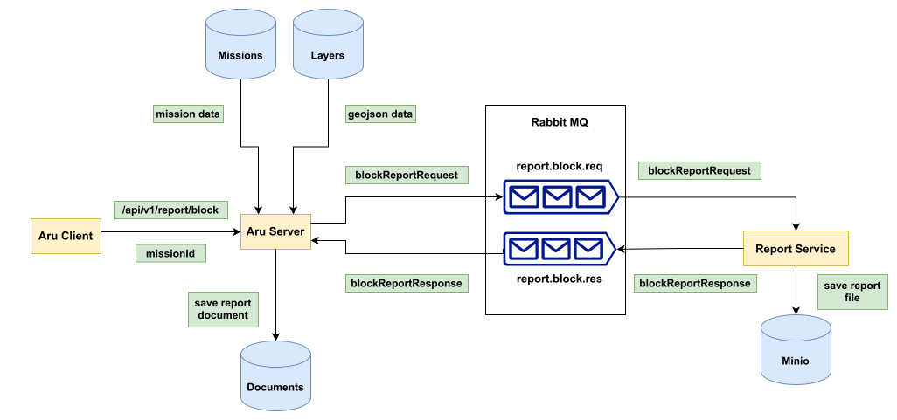

# Block Report Generation on Aru

The Block Report is a document containing information about a block.

## Table of Contents

- [Block Report Generation on Aru](#block-report-generation-on-aru)
  - [Table of Contents](#table-of-contents)
  - [Structure of Block Report](#structure-of-block-report)
  - [Overview](#overview)
    - [Messaging Queue](#messaging-queue)
      - [Structure of Request Message:](#structure-of-request-message)
      - [Structure of Response Message:](#structure-of-response-message)
    - [Client](#client)
    - [Server](#server)
    - [Report Service](#report-service)
  - [Generating Cover Page](#generating-cover-page)
    - [Identifying Major Components](#identifying-major-components)
    - [Structure of Data Required](#structure-of-data-required)
    - [Gathering the Data](#gathering-the-data)
  - [Generating Summary Page](#generating-summary-page)
    - [Identifying Major Components](#identifying-major-components-1)
    - [Structure of Data Required](#structure-of-data-required-1)
    - [Gathering the Data](#gathering-the-data-1)
  - [Generating Insights Page](#generating-insights-page)
    - [Identifying Major Components](#identifying-major-components-2)
    - [Structure of Data Required](#structure-of-data-required-2)
      - [**IDetailDesc**](#idetaildesc)
    - [Gathering the Data](#gathering-the-data-2)
  - [Generating Plot Details Page](#generating-plot-details-page)
    - [Identifying Major Components](#identifying-major-components-3)
    - [Structure of Data Required](#structure-of-data-required-3)
    - [Gathering the Data](#gathering-the-data-3)
  - [Generating Map Deliverables Page](#generating-map-deliverables-page)
    - [Identifying Major Components](#identifying-major-components-4)
    - [Structure of Data Required](#structure-of-data-required-4)
    - [Gathering the Data](#gathering-the-data-4)

## Structure of Block Report

The block report consists of the following main types of pages:

1. **Cover Page:** This is the first page of the report, containing information about the name of the block, an image showing the overview of features of the block, details of participants of the mission and date of report publication. Below is an example of a cover page:
   

2. **Summary Page:** This is the second page of the report. It consists of two tables: the **area table** and the **occupancy table**. The area table categorizes the entire area of the block under different [pre-defined categories](/documentation/report-generation/data_categorization.md), and stores them in units of `square metres`, `acres` and `percentage`. The occupancy table categorizes the various bounded areas on the map under different [pre-defined categories](/documentation/report-generation/data_categorization.md) and stores information regarding whether they are `occupied`, `under construction` or `vacant`. Below is an example of a summary page:
   

3. **Block Insights Page:** This is the third page of the report. It contains pre-defined sections, each containing information about presence of a particular feature in the map. The examples of such features include: Roads, Canals, Police Stations, Markets, etc. Below is an example of an insights page:
   

4. **Plot Details Page:** This is the fourth page of the report. It contains graphical elements. It contains a **bar chart** showing number of plots of different categories within the block. It contains two **pie charts** showing area distribution of [pre-defined categories](/documentation/report-generation/data_categorization.md) of areas in the block. It also contains two tables showing total area and number of plots for some [pre-defined](/documentation/report-generation/data_categorization.md) categories of plots. Below is an example of a plot details page:
   

5. **Map Deliverable Page(s):** These pages contain a map of the entire block, with a particular feature highlighted and marked in the map. The feature being marked on the map is being referred to as a `deliverable`. Examples of such features include: `built-up area`, `greenery`, `footpaths`, `encroachments`, etc. Below is an example of a map page showing built-up areas on the map of the block:
   

## Overview



The above diagram shows all the main components of the block report generation process. <br />

### Messaging Queue

The RabbitMQ messaging queue is used as a means of asynchronous communication between the `aru-server` to the `report-service` <br />
It has two queues related to the block report generation process:
1. `report.block.req` : The `aru-server` sends [`block report request`](#structure-of-request-message) message on this queue, which gets consumed by `report-service`
2. `report.block.res` : The `report-service` sends [`block report response`](#structure-of-response-message) message on this queue, which gets consumed by `aru-server`

#### Structure of Request Message:

```
{
  blockLayerpath: string;
  blockIdx: number;
  rasterLayerpath: string;
  blockName: string;
  tenantImagePath: string;
  
  actionArea: string;
  missionCode: string;
  tenantName: string;
  date: string;
  users: string[];
  emails: string[];
  phoneNos: string[];
  
  area: {
    total: number;
    privateSpaces: {
      name: string;
      value: number;
    }[];
    publicSpaces: {
      name: string;
      value: number;
    }[];
    other: number;
  };
  occupancy: {
    name: string;
    occupied: number;
    underConstruction: number;
    vacant: number;
  }[];
  
  roadCount: number;
  roadLength: number;
  cycleTrackLength: number;
  
  deliverables: {
    name: string;
    layerpath: string;
    layerType: vectorProps;
    imgBuffer: Buffer;
  }[];

  metadata: {
    mission_id: string;
    user_id: string;
    tenant_id: string;
    filename: string;
  };
}
```

#### Structure of Response Message:

```
{
  size: number;
  success: boolean;
  metadata: {
    mission_id: string;
    user_id: string;
    tenant_id: string;
    filename: string;
  };
  error?: string;
}
```

### Client

The block report generation process can be initiated from the aru web client from the `Report Generation` tab in the mission details page <br />

**Steps to initiate report generation:**
- Go to `Dashboard` (initial page after signing in)
- Go to `Missions`
- Choose a mission from the list and click on it to open the mission data page
- Go to `Report Generation` tab, and then to `Block` tab under it, and click `Generate Block Report`
- This sends a request on the `/api/report/block` endpoint on the server, containing the `missionId`

### Server

The server does the following tasks in order:
1. Find the mission using the `missionId`
2. Find all layers under the mission
3. Process each layer and find `area`, `length` and `vector` data from the layers using TurfJS
4. Using the `vector` property from processed data of the layers, categorize them into:
  - Area categories : `Residential` / `Commercial` / `Government` / `Government Commercial` (based on [this categorization]())
  - Occupancy status : `Occupied` / `Under Construction` / `Vacant` (based on [this categorization]())
5. Prepare the [`block report request`](#structure-of-request-message) and send it to the `report.block.req` queue
6. Consume the [`block report response`](#structure-of-response-message) from `report.block.res` queue, and: 
   - Save a document corresponding to the report in mongodb on successful report generation response
   - Log errors on failed report generation response

### Report Service

The server does the following tasks in order:
1. Consume the [`block report request`](#structure-of-request-message) from `report.block.req` queue
2. Capture the following screenshots:
   - Cover Image using `rasterLayerpath` and `blockLayerpath`
   - Area Category Pie Chart Image using `area` field of data
   - Occupancy Status Pie Chart Image using `occupancy` field of data
   - Combined Bar Chart Image using `area` and `occupancy` fields of data
3. Read the tenant logo from `minio` using `tenantImagePath`
4. Prepare the following report pages using `docx` library utilities, using the data extracted from request and the image data generated / gathered:
   - [Cover Page](#generating-cover-page)
   - [Summary Page](#generating-summary-page)
   - [Insights Page](#generating-insights-page)
   - [Plot Details Page](#generating-plot-details-page)
   - [Map Deliverable Pages](#generating-map-deliverables-page)
5. Generate the report document, and save it to `minio`
6. Send the [`block report response`](#structure-of-response-message) to the `report.block.res` queue

## Generating Cover Page

The cover page is the first page of the report

### Identifying Major Components


The components are:

| Sl. No. | Component                         | Variable or Constant |
| ------- | --------------------------------- | -------------------- |
| 1       | Tenant Logo                       | Variable             |
| 2       | Block Report Heading              | Variable             |
| 3       | Federal Synergies Logo            | Constant             |
| 4       | Block Name and Area Heading       | Variable             |
| 5       | Report Id                         | Variable             |
| 6       | Block overview image              | Variable             |
| 7       | Information Table:                | Variable             |
| 7.1     | Block Name                        | Variable             |
| 7.2     | User and Pilot names              | Variable             |
| 7.3     | Date of Report Publication        | Variable             |
| 7.4     | Phone Number(s) of User and Pilot | Variable             |
| 7.5     | Email(s) of User and Pilot        | Variable             |
| 7.6     | Statement of Confidentiality      | Variable             |

### Structure of Data Required

```
interface IPage1Properties {
  missionHeading: string;
  missionSubHeading: string;
  missionMapImg: Buffer;
  tenantImageBuffer: Buffer;
  tenantName: string;
  missionCode: string;
  date: string;
  users: string[];
  emails: string[];
  phoneNos: string[];
}
```

| Name              | Type      | Required By     | Description                                                       |
| ----------------- | --------- | --------------- | ----------------------------------------------------------------- |
| missionHeading    | string    | Component (4)   | Heading of the cover page, set to `ACTION AREA - {actionArea}` where `actionArea` comes from [`the request`](#structure-of-request-message)|
| missionSubHeading | string    | Component (4)   | Sub Heading of the cover page, set to `BLOCK - {blockName}` where `blockName` comes from [`the request`](#structure-of-request-message)                                                 |
| missionMapImg     | Buffer    | Component (6)   | Image of map with the block marked on it, as a binary Buffer      |
| tenantImageBuffer | Buffer    | Component (6)   | Logo of the tenant organization, as a binary Buffer               |
| tenantName        | string    | Component (6)   | Name of the tenant organization                                   |
| missionCode       | string    | Component (5)   | Id of the report                                                  |
| date              | string    | Component (7.3) | Date of generation of report                                     |
| users             | string[ ] | Component (7.2) | Names of users and pilots who participated in the mission          |
| emails            | string[ ] | Component (7.5) | Emails of users and pilots who participated in the mission        |
| phoneNos          | string[ ] | Component (7.4) | Phone Numbers of users and pilots who participated in the mission |

### Gathering the Data

- The `missionMapImg` and `tenantImageBuffer` are generated and fetched respectively by the report service.
- All other fields are collected within the report controller in the server and sent within the request message. 

## Generating Summary Page

The summary page is the second page of the report

### Identifying Major Components


The components are:

| Sl. No. | Component                               | Variable or Constant |
| ------- | --------------------------------------- | -------------------- |
| 1       | Area Data Table                         | Variable             |
| 2       | Occupancy Data Table                    | Variable             |
| 3       | Note about occupancy data               | Constant             |
| 4       | Report Id                               | Variable             |
| 5       | Summary Heading                         | Constant             |
| 6       | Block overview image                    | Variable             |
| 7       | Name of location under which Block lies | Variable             |
| 8       | Name of the Block                       | Variable             |

### Structure of Data Required

```
interface IPage2Properties {
  missionHeading: string;
  missionSubHeading: string;
  missionMapImg: Buffer;
  missionCode: string;
  area: {
    total: number;
    privateSpaces: {
      name: string;
      value: number;
    }[];
    publicSpaces: {
      name: string;
      value: number;
    }[];
    other: number;
  };
  occupancy: {
    name: string;
    occupied: number;
    underConstruction: number;
    vacant: number;
  }[];
}
```

| Name              | Type              | Required By   | Description                                                                                    |
| ----------------- | ----------------- | ------------- | ---------------------------------------------------------------------------------------------- |
| missionHeading    | string    | Component (4)   | Heading of the cover page, set to `ACTION AREA - {actionArea}` where `actionArea` comes from [`the request`](#structure-of-request-message)|
| missionSubHeading | string    | Component (4)   | Sub Heading of the cover page, set to `BLOCK - {blockName}` where `blockName` comes from [`the request`](#structure-of-request-message)                                                 |
| missionMapImg     | Buffer    | Component (6)   | Image of map with the block marked on it, as a binary Buffer      |
| missionCode       | string            | Component (4) | Id of the report                                                                               |
| area              | (mentioned above) | Component (1) | Details of areas of the different [pre-defined categories](/documentation/report-generation/data_categorization.md) into which the block can be split     |
| occupancy         | (mentioned above) | Component (2) | Details of occupancy of the different [pre-defined categories](/documentation/report-generation/data_categorization.md) into which the block can be split |

### Gathering the Data

- The `missionMapImg` is generated by the report service.
- All other fields are collected within the report controller in the server and sent within the request message. 

## Generating Insights Page

The block specific insights page is the thrid page of the report

### Identifying Major Components


The components are:

| Sl. No. | Component                             | Variable or Constant |
| ------- | ------------------------------------- | -------------------- |
| 1       | Page Heading                          | Constant             |
| 2       | Report Id                             | Variable             |
| 3       | Roads Section                         | Variable             |
| 4       | Footpath Section                      | Variable             |
| 5       | Greenery Section                      | Variable             |
| 6       | Canal Section                         | Variable             |
| 7       | Water Bodies Section                  | Variable             |
| 8       | Waste Bin Section                     | Variable             |
| 9       | Construction Sites Section            | Variable             |
| 10      | Cycle Track Section                   | Variable             |
| 11      | Street Light Section                  | Variable             |
| 12      | Parking Section                       | Variable             |
| 13      | Public Market Section                 | Variable             |
| 14      | Stubble Burning Section               | Variable             |
| 15      | Police Station / Fire Station Section | Variable             |
| 16      | Water and Drainage Network Section    | Variable             |
| 17      | Public Art Section                    | Variable             |
| 18      | Rooftop Solar Section                 | Variable             |
| 19      | Public Gym Section                    | Variable             |
| 20      | Others Section                        | Variable             |

### Structure of Data Required

```
interface IPage3Properties {
  missionCode: string;
  roadData: string | IDetailDesc[];
  footpathData: string | IDetailDesc[];
  greeneryData: string | IDetailDesc[];
  canalData: string | IDetailDesc[];
  waterBodyData: string | IDetailDesc[];
  roadData: string | IDetailDesc[];
  wasteBinData: string | IDetailDesc[];
  constructionSitesData: string | IDetailDesc[];
  cycleTrackData: string | IDetailDesc[];
  streetLightData: string | IDetailDesc[];
  parkingData: string | IDetailDesc[];
  publicMarketData: string | IDetailDesc[];
  stubbleBurningData: string | IDetailDesc[];
  policeAndFireStationsData: string | IDetailDesc[];
  waterAndDrainageNetworkData: string | IDetailDesc[];
  publicArtData: string | IDetailDesc[];
  publicGymData: string | IDetailDesc[];
  rooftopSolarData: string | IDetailDesc[];
  othersData: string | IDetailDesc[];
}
```

#### **IDetailDesc**

`IDetailDesc` is a recursive type:

```
interface IDetailDesc {
  name: string;
  value: string | IDetailDesc[];
}
```

The descriptions of each key in `IPageProperties` is self-explanatory from their names and after looking at the sections in the sample image. <br/>

**Why a recursive type ?** <br/>

As it can be observed, each section on the `insights` page has a `bulleted or numbered list` of `key-value pairs` in the contents. The value corresponding to a key can either be a string, in which case there is no branching to sub lists. Or, it can be another list. <br/>

Take the Road Data from the sample image as an example:

```
  i. "Number of roads": "6"
 ii. "Road Length": "2161.19 mt (Approx)"
iii. "Roads shared with adjacent blocks":
      a. "Adjacent Blocks": "AG, AE, AA"
      b. "Street no. shared":
          1. "45 with AG Block"
          2. "53 with AA Block"
```

The `IDetailsDesc` recursive type is designed to handle this scenario. The above data can be represented as an `IDetailsDesc[]` as follows:

```
[
  { name: "Number of roads", value: "6" },
  { name: "Road Length", value: "2161.19 mt (Approx)" },
  { name: "Roads shared with adjacent blocks",
    value: [
      { name: "Adjacent Blocks", value: "AG, AE, AA" },
      { name: "Street No. shared",
        value: [
          { name: "", value: "45 with AG Block" },
          { name: "", value: "53 with AA Block" }
        ]
      },
    ]
  }
]
```

### Gathering the Data

All data required for this page is collected within the report controller in the server and sent within the request message.

## Generating Plot Details Page

The plot details page is the fourth page of the report

### Identifying Major Components


The components are:

| Sl. No. | Component                                      | Variable or Constant |
| ------- | ---------------------------------------------- | -------------------- |
| 1       | Heading                                        | Variable             |
| 2       | SubHeading                                     | Constant             |
| 3       | Report Id                                      | Variable             |
| 4       | Occupancy Bar Chart Image                      | Variable             |
| 5       | Area Distribution by category Pie Chart Image  | Variable             |
| 6       | Area Distribution by occupancy Pie Chart Image | Variable             |
| 7       | Area Data Table                                | Variable             |
| 8       | Occupancy Data Table                           | Variable             |
| 9       | Tenant Logo                                    | variable             |
| 10      | Kesowa Logo                                    | Constant             |

### Structure of Data Required

```
interface IPage4Properties {
  heading: string;
  subheading: string;
  categoryPieChart: Buffer;
  statusPieChart: Buffer;
  barChart: Buffer;
  area: {
    total: number;
    privateSpaces: {
        name: string;
        value: number;
    }[];
    publicSpaces: {
        name: string;
        value: number;
    }[];
    other: number;
  };
  occupancy: {
    name: string;
    occupied: number;
    underConstruction: number;
    vacant: number;
  }[];
}
```

| Name             | Type              | Required By                                                                | Description                                                                                    |
| ---------------- | ----------------- | -------------------------------------------------------------------------- | ---------------------------------------------------------------------------------------------- |
| heading          | string            | Component (1)                                                              | Heading of Plot Details page, currently set to `ACTION AREA - ${actionArea} \| BLOCK ${blockName}` where `actionArea` and `blockName` come from [`the request`](#structure-of-request-message)|
| subheading       | string            | Component (2)                                                              | Constant, `"Plot Details"`                                                                     |
| categoryPieChart | Buffer            | Component (5) | Image of the area distribution by category pie chart as a binary Buffer    |
| statusPieChart   | Buffer            | Component (6) | Image of the area distribution by plot status pie chart as a binary Buffer |
| barChart         | Buffer            | Component (4) | Image of the occupancy bar chart as a binary Buffer                        |
| area             | (mentioned above) | Component (5, 7)                                                           | Details of areas of the different [pre-defined categories](/documentation/report-generation/data_categorization.md) into which the block can be split     |
| occupancy        | (mentioned above) | Component (4, 6, 8)                                                        | Details of occupancy of the different [pre-defined categories](/documentation/report-generation/data_categorization.md) into which the block can be split |
| tenantImageBuffer | Buffer | Component (9) | Logo image of tenant organization, as a binary buffer |
| missionCode       | string            | Component (3) | Id of the report |

### Gathering the Data

- The `categoryPieChart`, `statusPieChart` and `barChart` are generated by the report service.
- The `tenantImageBuffer` is fetched from `minio` by report service.
- All other fields are collected within the report controller in the server and sent within the request message. 

## Generating Map Deliverables Page

The map deliverables page(s) follow the fourth page of the report. There can be any number of such pages. **One map deliverable page is generated for each layer of the mission**.

### Identifying Major Components


The components are:

| Sl. No. | Component         | Variable or Constant |
| ------- | ----------------- | -------------------- |
| 1       | Heading           | Variable             |
| 2       | Deliverable Name  | Variable             |
| 3       | Report Id         | Variable             |
| 4       | Deliverable Image | Variable             |
| 5       | Tenant Logo       | Variable             |
| 6       | Kesowa Logo       | Constant             |

### Structure of Data Required

The constants can be ignored. Only the variables need to be considered. The structure of data required by `reportMapPage` function is thus the following:

```
interface IReportMapPageProperties {
  heading: string;
  subheading: string;
  imgBuffer: Buffer;
  tenantImageBuffer: Buffer;
  missionCode: string;
}
```

| Name       | Type   | Required By                                                             | Description                                                             |
| ---------- | ------ | ----------------------------------------------------------------------- | ----------------------------------------------------------------------- |
| heading          | string            | Component (1)                                                              | Heading of Deliverable page, currently set to `ACTION AREA - ${actionArea} \| BLOCK ${blockName}` where `actionArea` and `blockName` come from [`the request`](#structure-of-request-message)|
| subheading       | string            | Component (2)                                                              | Sub-heading of Deliverable page, currently set to the layer name |
| imgBuffer  | Buffer | Component (4) | Image of the map with the deliverables marked on it, as a binary Buffer |
| tenantImageBuffer | Buffer | Component (5) | Logo image of tenant organization, as a binary buffer |
| missionCode       | string            | Component (3) | Id of the report |

### Gathering the Data

- The `imgBuffer` is generated by the report service.
- The `tenantImageBuffer` is fetched from `minio` by report service.
- All other fields are collected within the report controller in the server and sent within the request message. 