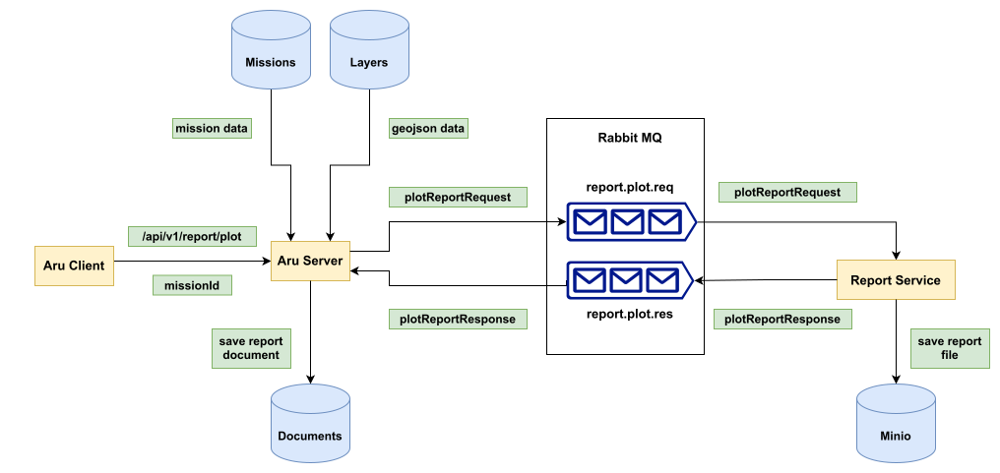

# Plot Report Generation on Aru

The Plot Report is a document containing information about a plot.

## Table of Contents

- [Plot Report Generation on Aru](#plot-report-generation-on-aru)
  - [Table of Contents](#table-of-contents)
  - [Structure of Plot Report](#structure-of-plot-report)
  - [Overview](#overview)
    - [Messaging Queue](#messaging-queue)
      - [Structure of Request Message:](#structure-of-request-message)
      - [Structure of Response Message:](#structure-of-response-message)
    - [Client](#client)
    - [Server](#server)
    - [Report Service](#report-service)
  - [Generating Cover Page](#generating-cover-page)
    - [Identifying Major Components](#identifying-major-components)
    - [Structure of Data Required](#structure-of-data-required)
    - [Gathering the Data](#gathering-the-data)
  - [Generating Block, Plot and Front View Image Pages](#generating-block-plot-and-front-view-image-pages)
    - [Identifying Major Components](#identifying-major-components-1)
    - [Structure of Data Required](#structure-of-data-required-1)
    - [Gathering the Data](#gathering-the-data-1)
  - [Generating Annual Invoice Commitment Page(s)](#generating-annual-invoice-commitment-pages)
    - [Identifying Major Components](#identifying-major-components-2)
    - [Structure of Data Required](#structure-of-data-required-2)
    - [Gathering the Data](#gathering-the-data-2)

## Structure of Plot Report

The plot report consists of the following main types of pages:

1. **Cover Page:** This is the first page of the report, containing information about the name of the block in which the plot is present, an image showing the overview of features of that block, names of participants of the mission and date of report publication. Below is an example of a cover page:
   

2. **Block Image Page:** This is the second page of the report, containing an image of the entire block in which the plot is present. Below is an example of a block image page:
   

3. **Plot Image Page:** This is the third page of the report, containing an image of the plot. Below is an example of a plot image page:
   

4. **Front View Image Page:** This is the fourth page of the report, containing an image of the front view of the plot. Below is an example of a front view image page:
   

5. **Annual Invoice Commitment Page(s):** This section starts at the fifth page of the report and can continue for multiple pages. It contains four tables containing `plot details`, `block details`, `block insights` and `block announcements`. Below is an example of an annual invoice commitment page:
   

## Overview



The above diagram shows all the main components of the plot report generation process. <br />

### Messaging Queue

The RabbitMQ messaging queue is used as a means of asynchronous communication between the `aru-server` to the `report-service` <br />
It has two queues related to the plot report generation process:
1. `report.plot.req` : The `aru-server` sends [`plot report request`](#structure-of-request-message) message on this queue, which gets consumed by `report-service`
2. `report.plot.res` : The `report-service` sends [`plot report response`](#structure-of-response-message) message on this queue, which gets consumed by `aru-server`

#### Structure of Request Message:

```
{
  // data required for screenshots
  plotLayerpath: string,
  plotIdx: number,
  blockLayerpath: string,
  blockIdx: number,
  rasterLayerpath: string,
  plotLayerFilepath: string;
  tenantImagePath: string;

  // plot details
  plotArea: number; 
  plotNo?: string; 
  premiseNo?: string; 
  pincode?: string; 
  category?: string; 
  infraction?: string; 
  isGreenTopEligible?: string; 
  isSolarPlantEligible?: string; 
  hasTradeLicense?: string; 
  tax?: string; 

  // building details
  buildingArea: number; 
  buildingFootprint: number;
  buildingAvailable?: string; 
  floorCount?: string; 
  buildingNo?: string; 
  hasCompletionCertificate?: string; 
  buildingHeight?: string; 

  // block details
  blockArea: number; 
  greeneryArea: number; 
  canopyArea: number; 
  waterbodyArea: number; 
  greeneryPercent: number; 
  canopyPercent: number; 
  waterbodyPercent: number; 
  garbageCollectionInfo?: string; 
  averageBuildingHeight?: string; 
  averageBlockHeight?: string; 
  averageIncentives?: string; 

  // all other data
  blockName?: string;
  date: string;
  users: string[];
  tenantName: string;
  metadata: {
    mission_id: string;
    user_id: string;
    tenant_id: string;
    filename: string;
  };
};
```

#### Structure of Response Message:

```
{
  size: number;
  success: boolean;
  metadata: {
    mission_id: string;
    user_id: string;
    tenant_id: string;
    filename: string;
  };
  error?: string;
}
```

### Client

The plot report generation process can be initiated from the aru web client from the `Report Generation` tab in the mission details page <br />

**Steps to initiate report generation:**
- Go to `Dashboard` (initial page after signing in)
- Go to `Missions`
- Choose a mission from the list and click on it to open the mission data page
- Go to `Report Generation` tab, and then to `Plot` tab under it, and click `Generate Plot Report`
- This sends a request on the `/api/report/plot` endpoint on the server, containing the `missionId`

### Server

The server does the following tasks in order:
1. Find the mission using the `missionId`
2. Search for layers of the following types under the mission, and extract the respective data from them:
   - `"ORTHO"` Layer => for ortho image of area captured by the drone
   - `"Block Boundary"` Layer => for block data insights
   - `"Plot"` Layer => plots are connected to block by `blockName`
   - `"Building Footprint"` Layer => buildings are connected to plot by `premiseNo`
   - `"Waterbody"` Layer => area intersection with block for waterbody %
   - `"Jungle"` Layer => area intersection with block for tree cover %
   - `"Green Verge"` Layer => area intersection with block for greenery %
   - `"Garbage Collection Point"` Layer => feature intersection with block count for number of garbage collection points
3. If any of the mentioned layer types not found, or malformed geojson found corresponding to that layer, report these errors in csv format
4. Prepare the [`plot report request`](#structure-of-request-message) and send it to the `report.plot.req` queue
5. Consume the [`plot report response`](#structure-of-response-message) from `report.plot.res` queue, and: 
   - Save a document corresponding to the report in mongodb on successful report generation response
   - Log errors on failed report generation response

### Report Service

The server does the following tasks in order:
1. Consume the [`plot report request`](#structure-of-request-message) from `report.plot.req` queue
2. Capture the following screenshots:
   - Cover Image using `rasterLayerpath`, `plotLayerpath` and `blockLayerpath`
   - Block Image using `rasterLayerpath` and `blockLayerpath`
   - Plot Image using `rasterLayerpath` and `plotLayerpath`
3. Read the front view image from `minio` using `plotLayerFilepath`
4. Read the tenant logo from `minio` using `tenantImagePath`
5. Prepare the following report pages using `docx` library utilities, using the data extracted from request and the image data generated / gathered:
   - [Cover Page](#generating-cover-page)
   - [Block Image Page](#generating-block-plot-and-front-view-image-pages)
   - [Plot Image Page](#generating-block-plot-and-front-view-image-pages)
   - [Front View Image Page](#generating-block-plot-and-front-view-image-pages)
   - [Annual Invoice Commitment Page](#generating-annual-invoice-commitment-pages)
6. Generate the report document, and save it to `minio`
7. Send the [`plot report response`](#structure-of-response-message) to the `report.plot.res` queue

## Generating Cover Page

The cover page is the first page of the report

### Identifying Major Components


The components are:

| Sl. No. | Component                         | Variable or Constant |
| ------- | --------------------------------- | -------------------- |
| 1       | Tenant Logo                       | Variable             |
| 2       | Block name                        | Variable             |
| 3       | Federal Synergies Logo            | Constant             |
| 4       | User and Pilot names              | Variable             |
| 5       | Date of Report Publication        | Variable             |
| 6       | Statement of Confidentiality      | Variable             |
| 7       | Cover Page Image                  | Variable             |

### Structure of Data Required

```
interface IPage1Properties {
  blockName: string;
  coverImageBuffer: Buffer;
  tenantImageBuffer: Buffer;
  date: string;
  users: string[];
  tenantName: string;
}
```

| Name              | Type      | Required By       | Description                                                       |
| ----------------- | --------- | ----------------- | ----------------------------------------------------------------- |
| tenantImageBuffer | Buffer    | Component (1)     | Image of the logo of the tenant organization, as a binary Buffer  |
| blockName         | string    | Component (2)     | Name of the block in which the plot is present                    |
| users             | string[ ] | Component (4)     | Names of users and pilots who participated in the mission         |
| date              | string    | Component (5)     | Date of generation of the report                                  |
| tenantName        | string    | Component (6)     | Name of the tenant organization                                   |
| coverImageBuffer  | Buffer    | Component (7)     | Image of map with block and plot marked on it, as a binary Buffer |

### Gathering the Data

- The `blockName`, `date`, `users` and `tenantName` are collected within the report controller in the server and sent within the request message. 
- The `coverImageBuffer` and `tenantImageBuffer` are generated by the report service.

## Generating Block, Plot and Front View Image Pages

These image pages have a similar structure: a fixed heading and an image

### Identifying Major Components


The components are:

| Sl. No. | Component                         | Variable or Constant |
| ------- | --------------------------------- | -------------------- |
| 1       | Heading                           | Constant             |
| 2       | Image                             | Variable             |

### Structure of Data Required

```
interface IDeliverable {
  imageHeading: string;
  imageBuffer: Buffer;
}
```

| Name              | Type      | Required By      | Description                                                                                            |
| ----------------- | --------- | ---------------- | ------------------------------------------------------------------------------------------------------ |
| imageHeading      | string    | Component (1)    | Heading of the page: "`Block Image`", "`Plot Image`" and "`Front View Image`" for the respective pages |
| imageBuffer       | Buffer    | Component (2)    | Image of map with block/plot marked on it, or the front view image, as a binary Buffer                 |

### Gathering the Data

- The `imageHeading` is constant and equal to "`Block Image`", "`Plot Image`" and "`Front View Image`" for the respective pages
- The `imageBuffer` is generated by the report service, from screenshots for the block and plot images, and from image attached to the layer for front view

## Generating Annual Invoice Commitment Page(s)

The annual invoice commitment pages are the last pages of the report

### Identifying Major Components


The components are:

| Sl. No. | Component                         | Variable or Constant |
| ------- | --------------------------------- | -------------------- |
| 1       | Block heading                     | Variable             |
| 2       | Plot Data Table                   | Variable             |
| 3       | Block Data Table                  | Variable             |
| 4       | Block Insights Table              | Variable             |
| 5       | Block Announcements Table         | Variable             |

### Structure of Data Required

```
interface IPage3Properties {
  blockName: string;

  // plot data table
  plotNo: string; 
  premiseNo: string; 
  plotArea: number; 
  buildingAvailable: string;
  pincode: string; 
  category: string; 
  floorCount: string; 
  buildingNo: string; 
  buildingArea: number; 
  buildingFootprint: number;
  hasCompletionCertificate: string; 
  averageBuildingHeight: string; 
  infraction: string; 
  isGreenTopEligible: string; 
  isSolarPlantEligible: string; 
  hasTradeLicense: string; 
  tax: string; 

  // block data table
  garbageCollectionInfo: string; 
  buildingHeight: string; 
  averageBlockHeight: string; 
  averageIncentives: string; 

  // block insights table
  greeneryPercent: number; 
  canopyPercent: number; 
  waterbodyPercent: number; 
}
```

| Name                      | Type      | Required By      | Description                                                               |
| -----------------         | --------- | ---------------  | ------------------------------------------------------------------------- |
| blockName                 | string    | Component (1)    | Name of the block in which the plot is present                            |
| plotNo                    | string    | Component (2)    | Plot Number of the plot                                                   |
| premiseNo                 | string    | Component (2)    | Premise Number that connects buildings of a plot to the plot              |
| plotArea                  | number    | Component (2)    | Area of the plot                                                          |
| buildingAvailable         | string    | Component (2)    | `Yes` or `No` based on whether there is an available building in the plot |
| pincode                   | string    | Component (2)    | Pincode of the plot                                                       |
| category                  | string    | Component (2)    | Category of the plot (`Residential`/`Commercial`/`Government`)            |
| floorCount                | string    | Component (2)    | Number of floors in the building present in the plot                      |
| buildingNo                | string    | Component (2)    | Building number of the building in the plot                               |
| buildingArea              | number    | Component (2)    | Area of the building in the plot                                          |
| buildingFootprint         | number    | Component (2)    | Percentage area of the plot covered by the building                       |
| hasCompletionCertificate  | string    | Component (2)    | `Yes` or `No` based on whether the building in the plot has a completion certificate |
| buildingHeight            | string    | Component (2)    | Height of the building in the plot                                        |
| infraction                | string    | Component (2)    | `Yes` or `No` based on whether the plot is an infraction                  |
| isGreenTopEligible        | string    | Component (2)    | `Yes` or `No` based on whether the plot is green top eligible             |
| isSolarPlantEligible      | string    | Component (2)    | `Yes` or `No` based on whether the plot is solar panel eligible           |
| hasTradeLicense           | string    | Component (2)    | `Yes` or `No` based on whether the plot has a trade license               |
| tax                       | string    | Component (2)    | Tax of the plot                                                           |
| garbageCollectionInfo     | string    | Component (3)    | Number of garbage collection points in the block                          | 
| averageBuildingHeight     | string    | Component (3)    | Average height of buildings in the block                                  | 
| averageBlockHeight        | string    | Component (3)    | Average height of all structures in the block                             | 
| averageIncentives         | string    | Component (3)    | Average height of the block                                               | 
| greeneryPercent           | number    | Component (4)    | Percentage area of block covered in greenery                              | 
| canopyPercent             | number    | Component (4)    | Percentage area of block covered in canopy (jungle / tree cover)          | 
| waterbodyPercent          | number    | Component (4)    | Percentage area of block covered in waterbody                             |

### Gathering the Data

All information required for filling the tables is collected within the report controller in the server and sent within the request message
